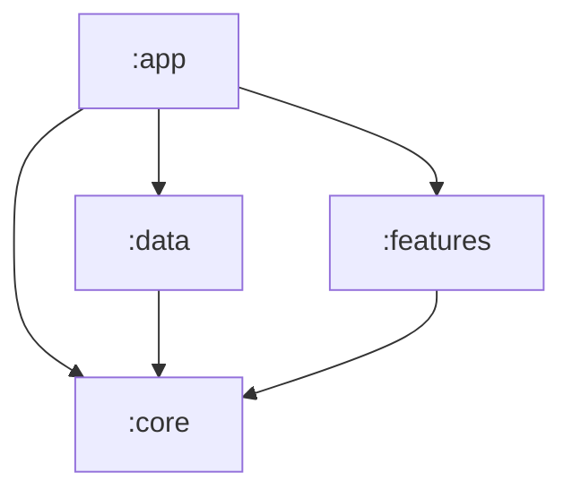

# Kairos

Kairos is a local-first Android application for clinical case documentation. It records patients, cases, diagnoses, shifts, consultation sessions, rich notes, and media attachments, with search, dashboard metrics, case sharing, backup/restore, trash retention, and a quick-capture widget.

Clinical records remain on the device. Firebase Firestore is used only to authorize an installation; Kairos has no account login or remote clinical-data synchronization.

## Documentation

The complete engineering documentation is an Obsidian-compatible knowledge base in [`docs`](docs). Open that folder as a vault and start at [`docs/Home.md`](docs/Home.md).

| Area | Entry point |
|---|---|
| Project, stack, build, and modules | [Overview](docs/Overview/Overview%20Index.md) |
| Runtime architecture | [Architecture](docs/Architecture/Architecture%20Index.md) |
| Layer boundaries | [Layers](docs/Layers/Layers%20Index.md) |
| User-facing capabilities | [Features](docs/Features/Features%20Index.md) |
| Classes and contracts | [Components](docs/Components/Components%20Index.md) |
| End-to-end traces | [Execution flows](docs/Execution%20Flows/Execution%20Flows%20Index.md) |
| Mermaid diagrams | [Diagrams](docs/Diagrams/Diagrams%20Index.md) |

Useful starting points:

- [Build system](docs/Overview/Build%20System.md)
- [Project architecture](docs/Diagrams/Project%20Architecture.md)
- [Configuration](docs/Architecture/Configuration.md)
- [Device authorization](docs/Features/Device%20Authorization.md)
- [Settings and backup](docs/Features/Settings%20and%20Backup.md)

## Architecture

Kairos is split into four Gradle modules. UI-facing modules depend on contracts in `:core`; implementations remain in `:data`.



| Module | Responsibility |
|---|---|
| `:app` | Application and activity entry points, authorization gate, navigation, widget, App Check initialization, and WorkManager configuration |
| `:core` | Domain models, repository contracts, authorization policy, shared Compose UI/theme, and media helpers |
| `:data` | Room, DataStore, repository implementations, Firestore authorization, backup/restore, workers, and Hilt bindings |
| `:features` | Compose screens, ViewModels, case PDF/ZIP exporters, and user workflows |

Feature ViewModels call repository interfaces directly; the project currently has no dedicated use-case/interactor classes. See the [dependency graph](docs/Diagrams/Dependency%20Graph.md) for the full boundary map.

## Requirements

- Android Studio with Android SDK 35
- JDK 17
- Android device or emulator running API 26 or newer
- Firebase configuration for device authorization

Dependency and plugin versions are centralized in [`gradle/libs.versions.toml`](gradle/libs.versions.toml). The checked-in Gradle wrapper is the supported build entry point.

## Build and test

On macOS or Linux:

```bash
./gradlew test assembleDebug
./gradlew :app:installDebug
```

On Windows PowerShell:

```powershell
.\gradlew.bat test assembleDebug
.\gradlew.bat :app:installDebug
```

Focused compile checks:

```powershell
.\gradlew.bat :features:compileDebugKotlin
.\gradlew.bat :data:kspDebugKotlin
```

The JVM test suite covers authorization state and lease policy, patient-name formatting, backup retention, and case archive generation. There is no instrumented `androidTest` suite at present.

## Device authorization setup

Device authorization is an installation whitelist, not a user credential flow. The app reads one server-forced Firestore document:

```text
authorized_devices/{deviceId}
```

The document must exist with a Boolean field `authorized: true`. Debug builds use the App Check debug provider; release builds use Play Integrity. Follow [`FIREBASE_DEVICE_AUTH_SETUP.md`](FIREBASE_DEVICE_AUTH_SETUP.md) to configure Firebase, register App Check, publish rules, and authorize a device.

Important runtime behavior:

- First launch and every reboot require a successful server check.
- A successful check grants a 24-hour lease plus up to 24 hours of offline grace.
- The protected navigation graph is created only after authorization succeeds.
- A locked installation may still perform an explicit recovery backup; scheduled backup and trash mutation pause.

## Data and backup safety

- Room schema version 2 stores clinical records; `MIGRATION_1_2` adds original attachment filenames.
- Preferences and authorization leases use separate DataStore files.
- Attachment bytes live in app-specific storage; Room stores relative paths.
- Android Auto Backup and device transfer are disabled to prevent inconsistent database/media restores.
- `BackupEngine` checkpoints Room, exports referenced media and settings, writes checksums, validates restores, and rolls back failed replacement.
- Soft-deleted records are recoverable until the authorized daily purge removes eligible data after 30 days.
- Repository writes, backup/restore, vacuum, and purge coordinate through a process-wide data lock.

Backup ZIPs and case PDF/ZIP exports are not encrypted by Kairos. They can contain sensitive patient information and must be stored and shared accordingly. See [Local Storage](docs/Layers/Local%20Storage.md) and [BackupEngine](docs/Components/Services/BackupEngine.md).

## Release builds

Release builds enable minification and Play Integrity App Check. `assembleRelease` requires a complete `keystore.properties` with:

- `storeFile`
- `storePassword`
- `keyAlias`
- `keyPassword`

Keep signing credentials and private keys out of version control. The `preReleaseBuild` verification task fails when configuration is incomplete or the signing key is missing.

```powershell
.\gradlew.bat assembleRelease
```

## Development rules of thumb

- Add feature-facing contracts and models to `:core`; implement persistence in `:data`.
- Keep Room, DataStore, and Firestore out of feature screens and ViewModels.
- Use existing repository interfaces and shared UI components before adding new boundaries.
- Serialize consistency-sensitive writes with `DataSafetyCoordinator`.
- Store managed media paths relative to the media root.
- Bump the Room version, add an explicit migration, and update exported schemas for every schema change.
- Update the relevant wiki pages when behavior, navigation, dependencies, or persistence changes.

Current boundaries and operational limitations—including no clinical cloud sync, no Retrofit/HTTP client, sparse production logging, and the absence of instrumented tests—are documented in [Networking](docs/Layers/Networking.md), [Logging](docs/Architecture/Logging.md), and [Error Handling](docs/Architecture/Error%20Handling.md).
