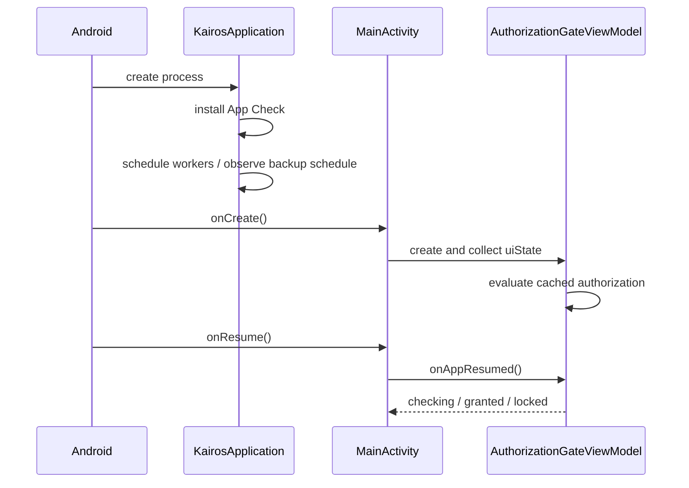

# Application Lifecycle

> **In plain words** — an app does not simply "start and run". Android creates it, shows it, hides it, and may destroy it at any moment to reclaim memory. This page traces that sequence for Kairos: the `Application` object is created first and does the once-per-app setup (attestation, scheduling background jobs, watching the backup setting); then `MainActivity` is created and draws the authorization gate; then, each time the user returns to the app, authorization is re-checked. The practical rule that follows: anything held only in memory can vanish, which is why facts go to the database and why returning to the app re-verifies access. See [[Learn/Android App Basics|Android App Basics]].

## Process Start

`KairosApplication` is the manifest application and Hilt root. Its `onCreate()` installs the build-specific Firebase App Check provider, registers periodic trash purge, and observes backup-schedule changes. It also supplies WorkManager with `HiltWorkerFactory`; the manifest removes WorkManager's default initializer.

## Activity Start and Foregrounding

`MainActivity.onCreate()` enables edge-to-edge layout, observes settings, applies `KairosTheme`, and renders the authorization gate. The navigation controller and feature UI are created only while access is granted.

`MainActivity.onResume()` calls `AuthorizationGateViewModel.onAppResumed()`. If the in-memory hard deadline is missing, expired, from another boot, or affected by wall-clock rollback, protected content is hidden synchronously before re-evaluation.

## Process-Lifetime Work

The application scope uses `SupervisorJob + Dispatchers.Default` and is not explicitly cancelled; it lives until process death. WorkManager persists periodic jobs across process restarts. See [[Architecture/Background Work|Background Work]] and [[Execution Flows/App Startup|App Startup]].

## Source references

- `app/src/main/AndroidManifest.xml`
- `app/src/main/java/com/taha/kairos/KairosApplication.kt`
- `app/src/main/java/com/taha/kairos/MainActivity.kt`
- `app/src/main/java/com/taha/kairos/authorization/AuthorizationGateViewModel.kt`
- `data/src/main/java/com/taha/kairos/data/backup/WorkerScheduler.kt`
