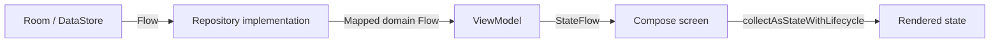
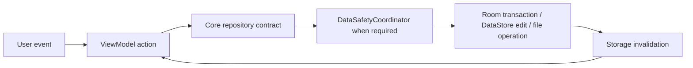

# Data Flow

> **In plain words** — reading and writing work differently on purpose. **Reading is a subscription:** a screen says "show me the cases for this diagnosis" once, and from then on the database *pushes* a new list every time the data changes. Nobody writes refresh code. **Writing is a command:** the user taps save, the ViewModel calls the repository, the repository writes it in one all-or-nothing transaction, and the write itself causes the read subscriptions to fire. That loop — write → storage notices → subscribed screens redraw — is the heart of the app. `Flow` is the word for such a subscription; see [[Learn/Coroutines And Flow|Coroutines And Flow]] and the worked example in [[Learn/Code Tour One Feature|Code Tour One Feature]].

Kairos separates reactive reads from command-style writes. Both cross the repository contracts in `:core`; screens never access DAOs or storage implementations directly.

## Reactive Read Path

Room invalidation and DataStore emissions automatically propagate changes. ViewModels commonly use `combine`, `flatMapLatest`, and `stateIn(WhileSubscribed(5_000))`; Compose collects with lifecycle awareness.

## Write Path

Patient/case/media writes use transactions and the data-safety lock to stay coherent with backup/restore. Repository mappers keep Room entities and relative media paths out of the UI.

## Remote Path

Clinical data is not sent to a server. The only runtime API path is device authorization: [[Components/ViewModels/AuthorizationGateViewModel|AuthorizationGateViewModel]] → [[Components/Repositories/DeviceAuthorizationRepository|DeviceAuthorizationRepository]] → Firestore `authorized_devices/{deviceId}`. See [[Execution Flows/API Request Lifecycle|API Request Lifecycle]].

Related: [[Layers/Data Layer|Data Layer]], [[Layers/Repositories|Repositories]], [[Layers/Mappers|Mappers]], and [[Diagrams/Repository Interactions|Repository Interactions]].

## Source references

- `features/src/main/java/com/taha/kairos/features/search/SearchViewModel.kt`
- `core/src/main/java/com/taha/kairos/core/repository/CaseRepository.kt`
- `data/src/main/java/com/taha/kairos/data/repository/CaseRepositoryImpl.kt`
- `data/src/main/java/com/taha/kairos/data/backup/DataSafetyCoordinatorImpl.kt`
- `data/src/main/java/com/taha/kairos/data/authorization/FirebaseDeviceAuthorizationRepository.kt`
