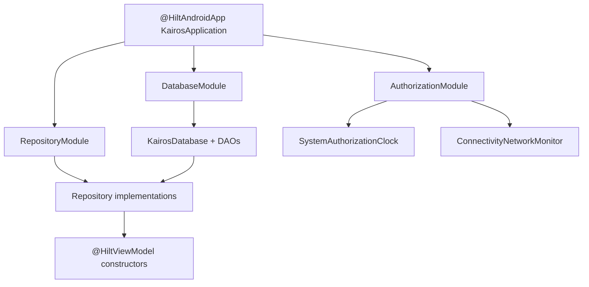

# Dependency Injection

> **In plain words** — classes here never build the things they need; they list them in their constructor and are handed them. **Hilt** is the tool that does the handing. It reads the `@` labels at build time and generates the wiring code, which is why you never see the database being constructed inside a screen. Two consequences worth internalising: there is exactly **one** database object for the whole app (that is what `@Singleton` guarantees), and a screen asking for a `CaseRepository` gets an implementation it cannot see, so it can be swapped for a fake in a test. Full beginner walkthrough: [[Learn/Dependency Injection Explained|Dependency Injection Explained]].

Hilt is the composition mechanism across all modules. `KairosApplication` is annotated with `@HiltAndroidApp`; `MainActivity` uses `@AndroidEntryPoint`; feature and authorization ViewModels use `@HiltViewModel`; workers use `@HiltWorker` with assisted context/parameters.

## Singleton Graph

`DatabaseModule` provides one `KairosDatabase` and its six DAOs. `RepositoryModule` binds `:core` contracts to singleton implementations in `:data`, including authorization, backup, and the data-safety coordinator.

`AuthorizationModule` binds Android-specific `AuthorizationClock` and `NetworkMonitor` implementations in `:app`.

## Boundary Effect

Feature ViewModels request interfaces such as [[Components/Repositories/CaseRepository|CaseRepository]], so `:features` needs no dependency on `:data`. The `:app` dependency on both modules makes all bindings available in the final application graph.

There are no use-case objects in the current graph; ViewModels orchestrate repositories directly. See [[Diagrams/Dependency Graph|Dependency Graph]] and [[Overview/Gradle Modules|Gradle Modules]].

## Source references

- `app/src/main/java/com/taha/kairos/KairosApplication.kt`
- `app/src/main/java/com/taha/kairos/authorization/AuthorizationModule.kt`
- `data/src/main/java/com/taha/kairos/data/di/DataModule.kt`
- `features/src/main/java/com/taha/kairos/features/dashboard/DashboardViewModel.kt`
- `data/src/main/java/com/taha/kairos/data/backup/ScheduledBackupWorker.kt`
