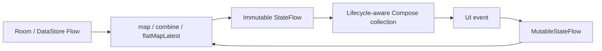

# State Management

> **In plain words** — *state* is simply "everything the screen currently needs to know in order to draw itself": the list of cases, whether it is still loading, what the user typed. Kairos keeps each screen's state in one object, owned by one ViewModel. The screen never edits that object; it reports events upward and redraws when a new version arrives. This is called **unidirectional data flow**, and it is why two parts of the app can never disagree about what is true. `StateFlow` is the container that holds the current state and notifies the screen; `remember` is reserved for trivial visual things like whether a dropdown is open. See [[Learn/Jetpack Compose Basics|Jetpack Compose Basics]] and [[Learn/Coroutines And Flow|Coroutines And Flow]].

State is unidirectional: storage and user events feed a ViewModel, the ViewModel exposes immutable `StateFlow`, and a Compose screen renders it with `collectAsStateWithLifecycle()`.

## State Sources

- Room and DataStore provide authoritative persistent `Flow` values.
- `MutableStateFlow` holds transient form fields, queries, dialogs, progress, errors, and one-shot payloads.
- `SavedStateHandle` supplies navigation arguments to detail ViewModels.
- `remember`/`rememberSaveable` is limited to view-local concerns such as pagers, clipboard feedback, and one-time widget handling.

## Composition

Most reactive ViewModels use `combine`, `map`, or `flatMapLatest`, then `stateIn(viewModelScope, SharingStarted.WhileSubscribed(5_000), initialState)`. Search debounces input for 250 ms before switching queries. Form-heavy [[Components/ViewModels/PatientCaseViewModel|PatientCaseViewModel]] owns a mutable state machine because edits are staged before a commit.

Transient messages are generally cleared after a snackbar consumes them. Navigation remains callback-driven and is not stored in shared application state. ViewModels do not call each other; shared repositories provide synchronization. See [[Execution Flows/State Updates|State Updates]] and [[Diagrams/ViewModel Interactions|ViewModel Interactions]].

## Source references

- `features/src/main/java/com/taha/kairos/features/search/SearchViewModel.kt`
- `features/src/main/java/com/taha/kairos/features/patient/PatientCaseViewModel.kt`
- `features/src/main/java/com/taha/kairos/features/settings/SettingsViewModel.kt`
- `features/src/main/java/com/taha/kairos/features/cases/CaseDetailViewModel.kt`
- `app/src/main/java/com/taha/kairos/MainActivity.kt`
