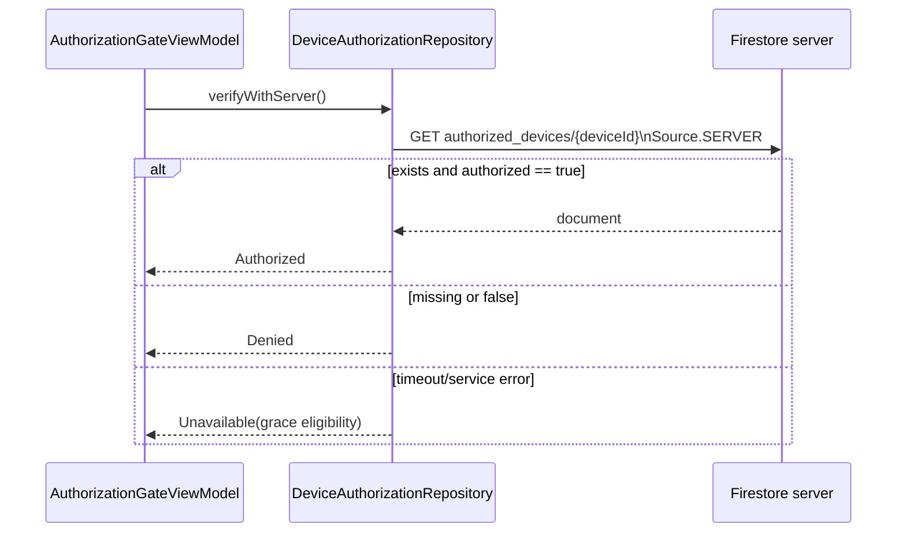

# Firebase Authorization API

> **In plain words** — the app's only conversation with a server, documented in full because it is small enough to be. One document is read, named after the device ID, and access is granted only if it exists and says `authorized = true`. The Firestore security rules deliberately allow *reading one exact document* and nothing else — no listing, no writing — so a client cannot enumerate which devices are approved. See [[Learn/Security And Privacy Basics|Security And Privacy Basics]].

## Purpose

Documents the sole remote request in Kairos: checking whether the current derived device ID is authorized in Firebase Firestore.

## Responsibilities

- Read the exact device document from the server, never the Firestore cache.
- Interpret only an existing document with `authorized == true` as authorized.
- Distinguish denial from temporary and fail-closed service errors.
- Enforce a 12-second client-side timeout.

## Dependencies

- Firebase Firestore and Firebase App Check.
- [[Components/Repositories/DeviceAuthorizationRepository]], [[Components/Utilities/FirebaseAppCheckInitializer]], and [[Components/Utilities/NetworkMonitor]].

## Called By

- `FirebaseDeviceAuthorizationRepository.verifyWithServer`, initiated by [[Components/ViewModels/AuthorizationGateViewModel]].

## Calls

- `FirebaseFirestore.getInstance(app).collection("authorized_devices").document(deviceId).get(Source.SERVER)`.
- Firestore document field `authorized`.

## Important Methods

- `verifyWithServer()` returns `Authorized`, `Denied`, or `Unavailable(message, mayUseOfflineGrace)`.
- `awaitWithoutKtx()` bridges a Firebase `Task` into cancellable coroutine suspension.
- `unavailableResult` classifies Firestore status codes for offline-grace eligibility.

## Design Patterns

- Forced-server security read, repository adapter, timeout boundary, and typed result mapping.

## Common Pitfalls

- A connected network is not proof the request will pass App Check, Firestore rules, or authentication infrastructure.
- `PERMISSION_DENIED`, `UNAUTHENTICATED`, invalid argument, and failed precondition do not permit offline grace.
- Missing Firebase configuration returns fail-closed `Unavailable` with no grace.
- This is not a Retrofit-style declared interface; the Firestore SDK call is direct.

## Related Pages

- [[Features/Device Authorization]]
- [[Components/Utilities/AuthorizationLeasePolicy]]
- [[Execution Flows/API Request Lifecycle]]

## Source References

- `data/src/main/java/com/taha/kairos/data/authorization/FirebaseDeviceAuthorizationRepository.kt`
- `firestore.rules`
- `FIREBASE_DEVICE_AUTH_SETUP.md`

