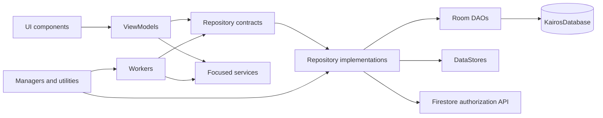

# Components Index

> **In plain words** — this is the reference section: one page per class, grouped by what kind of thing it is. Each page follows a fixed shape — Purpose, Responsibilities, Dependencies, Called By, Calls, Important Methods, Design Patterns, Common Pitfalls. Two of those are worth reading before any change: **Called By** tells you what breaks if you alter this, and **Common Pitfalls** lists traps already discovered. The group names decoded: *repositories* own data, *DAOs* run database queries, *mappers* convert between shapes, *ViewModels* hold screen state, *workers* run in the background, *managers/utilities/services* do one focused job each. Definitions: [[Learn/Design Patterns Glossary|Design Patterns Glossary]].

This index covers the concrete classes and contracts that make up Kairos. Pages combine an interface with its single implementation where separating them would duplicate the same responsibility.

## Data and Domain Components

- [[Components/Repositories/Repositories Index]]
- [[Components/DAOs/DAOs Index]]
- [[Components/Databases/Databases Index]]
- [[Components/Mappers/Mappers Index]]
- [[Components/APIs/APIs Index]]
- [[Components/Use Cases]]

## Runtime Components

- [[Components/ViewModels/ViewModels Index]]
- [[Components/Workers/Workers Index]]
- [[Components/Managers/Managers Index]]
- [[Components/Services/Services Index]]
- [[Components/Utilities/Utilities Index]]

## Presentation Components

- [[Components/UI/Reusable UI Components]]

## Component Relationship

## Source References

- `app/src/main/java/com/taha/kairos/MainActivity.kt`
- `core/src/main/java/com/taha/kairos/core/repository/CaseRepository.kt`
- `data/src/main/java/com/taha/kairos/data/di/DataModule.kt`
- `features/src/main/java/com/taha/kairos/features/patient/PatientCaseViewModel.kt`
