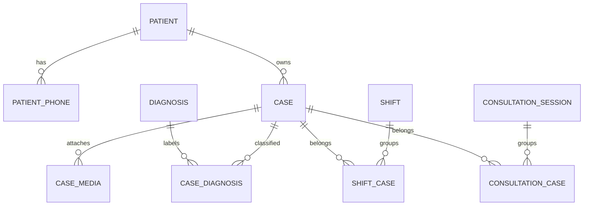

# KairosDatabase

> **In plain words** — the single database file (`kairos.db`) holding every clinical record, plus the list of tables it contains and the DAOs used to reach them. Exactly one instance exists for the whole app. The `version` number matters more than it looks: raising it without writing a matching **migration** means the app either crashes on launch or destroys existing patient data. See [[Learn/Databases And Room|Databases And Room]] and [[Components/Utilities/Migrations|Migrations]].

## Purpose

Defines the Room database for all patient, case, diagnosis, attachment, shift, and consultation metadata.

## Responsibilities

- Register ten Room entities and expose six DAOs.
- Version and export the Room schema.
- Provide the SQLite boundary used by transactions, backup, restore, and vacuum operations.

## Dependencies

- Entity files under `data/db/entities`, relation projections under `data/db/relations`, and every page in [[Components/DAOs/DAOs Index]].
- [[Components/Utilities/Migrations]] and Hilt `DatabaseModule`.

## Called By

- Repository implementations that need multi-query transactions.
- [[Components/Services/BackupEngine]]
- Hilt's `DatabaseModule` and all provided DAOs.

## Calls

- Room's generated database and DAO implementations.
- SQLite open-helper operations for backup checkpoint, validation, restore, and `VACUUM`.

## Important Methods

- `patientDao`, `caseDao`, `diagnosisDao`, `caseMediaDao`, `shiftDao`, and `consultationSessionDao` expose generated DAOs.
- `withTransaction` is used by aggregate repositories.
- `openHelper` is used only by controlled maintenance and backup code.

## Design Patterns

- Room database singleton, normalized relational schema, foreign-key cascades, junction tables, and explicit migrations.

## Common Pitfalls

- The production database name is `kairos.db`; backup and restore code assumes that exact name.
- Schema changes require a version bump, migration, `ALL_MIGRATIONS` registration, and updated exported schema.
- Successful restore closes the singleton database; the UI instructs the user to restart the app.
- `remote_id` and `sync_state` columns are reserved but no synchronization engine currently consumes them.

## Related Pages

- [[Components/Utilities/Migrations]]
- [[Components/Services/BackupEngine]]
- [[Execution Flows/Database Operations]]

## Source References

- `data/src/main/java/com/taha/kairos/data/db/KairosDatabase.kt`
- `data/src/main/java/com/taha/kairos/data/db/entities/`
- `data/src/main/java/com/taha/kairos/data/db/relations/`
- `data/src/main/java/com/taha/kairos/data/di/DataModule.kt`
- `data/schemas/com.taha.kairos.data.db.KairosDatabase/2.json`

