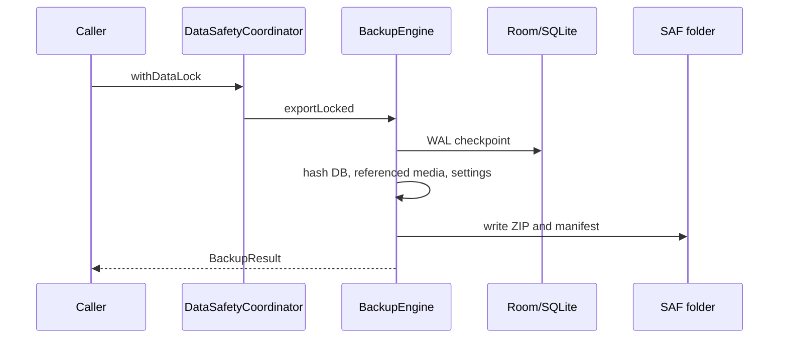

# BackupEngine

> **In plain words** — the machinery behind backup and restore, and one of the most important classes in the app because the phone holds the only copy of the data. Export bundles the database, the referenced media files, and the settings into one archive, with **checksums** — small fingerprints computed from the contents — so a corrupted backup can be detected rather than trusted. Restore *replaces* current data, which is why it is confirmed explicitly and followed by a restart. See [[Features/Settings and Backup|Settings and Backup]].

## Purpose

Implements complete, checksum-verified export and replacement restore of the Room database, referenced media, and user settings.

## Responsibilities

- Produce versioned ZIP backups through Android's Storage Access Framework.
- Checkpoint the WAL and include only database-referenced media.
- Validate archive structure, limits, checksums, schema, SQLite integrity, and foreign keys.
- Stage and swap database, media, and settings with rollback on failure.
- Run SQLite `VACUUM` under the global data lock.

## Dependencies

- [[Components/Repositories/BackupRepository]], [[Components/Repositories/DataSafetyCoordinator]], and [[Components/Databases/KairosDatabase]].
- [[Components/DAOs/CaseMediaDao]], [[Components/Managers/MediaFileManager]], DocumentFile, JSON, ZIP, SHA-256, and SQLite APIs.

## Called By

- [[Components/ViewModels/SettingsViewModel]] and [[Components/ViewModels/AuthorizationGateViewModel]] through `BackupRepository`.
- [[Components/Workers/ScheduledBackupWorker]] directly.

## Calls

- Room/SQLite checkpoint, version, close, and vacuum operations.
- SAF content resolver streams and DocumentFile creation.
- Filesystem staging, atomic move where supported, hashing, ZIP extraction, and rollback helpers.

## Important Methods

- `export(folderUri)` locks data and delegates to IO-bound `exportLocked`.
- `restore(zipUri)` locks data and delegates to `restoreLocked`.
- `vacuumDatabase()` executes `VACUUM` under the same lock.
- `validateManifest`, `validateExtractedFiles`, and `validateBackupDatabase` reject incompatible or corrupt input.
- `rollbackRestore` attempts to restore prior live files after a failed swap.

## Design Patterns

- Transaction-like staging and compensating rollback across non-transactional filesystems.
- Database snapshot under a coarse-grained lock.
- Manifest-based integrity, allowlisted compatibility, and zip-slip defense.

## Common Pitfalls

- Successful restore closes Room and requires an app restart before normal database use.
- The settings DataStore filename and database name are hard-coded compatibility contracts.
- The authorization DataStore is intentionally excluded from backup.
- Export size limits are high but finite: 20,000 entries, 10 GiB per entry, and 50 GiB total.
- A failed rollback is swallowed after the best-effort attempt; restore errors should be treated seriously.

## Related Pages

- [[Components/Repositories/BackupRepository]]
- [[Components/Utilities/BackupPruner]]
- [[Execution Flows/Database Operations]]

## Source References

- `data/src/main/java/com/taha/kairos/data/backup/BackupEngine.kt`
- `core/src/main/java/com/taha/kairos/core/repository/BackupRepository.kt`
- `features/src/main/java/com/taha/kairos/features/settings/SettingsScreen.kt`

