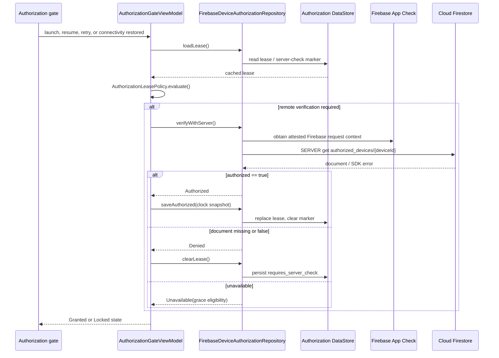

# API Flow

> **In plain words** — the only network conversation the app has, drawn as a sequence: the gate asks the repository to verify, the repository gets an attestation token from App Check, reads one Firestore document, and the answer is stored as a lease in DataStore. Read the vertical lines as participants and the arrows as calls, top to bottom. See [[Learn/Security And Privacy Basics|Security And Privacy Basics]].

The request bypasses Firestore's local cache and times out after 12 seconds. No clinical data crosses this API boundary.

See [[Execution Flows/API Request Lifecycle|API Request Lifecycle]], [[Execution Flows/Login Flow|Login Flow]], and [[Components/APIs/Firebase Authorization API|Firebase Authorization API]].

## Source references

- `core/src/main/java/com/taha/kairos/core/authorization/AuthorizationModels.kt`
- `app/src/main/java/com/taha/kairos/authorization/AuthorizationGateViewModel.kt`
- `data/src/main/java/com/taha/kairos/data/authorization/FirebaseDeviceAuthorizationRepository.kt`
- `app/src/debug/java/com/taha/kairos/FirebaseAppCheckInitializer.kt`
- `app/src/release/java/com/taha/kairos/FirebaseAppCheckInitializer.kt`
- `firestore.rules`

