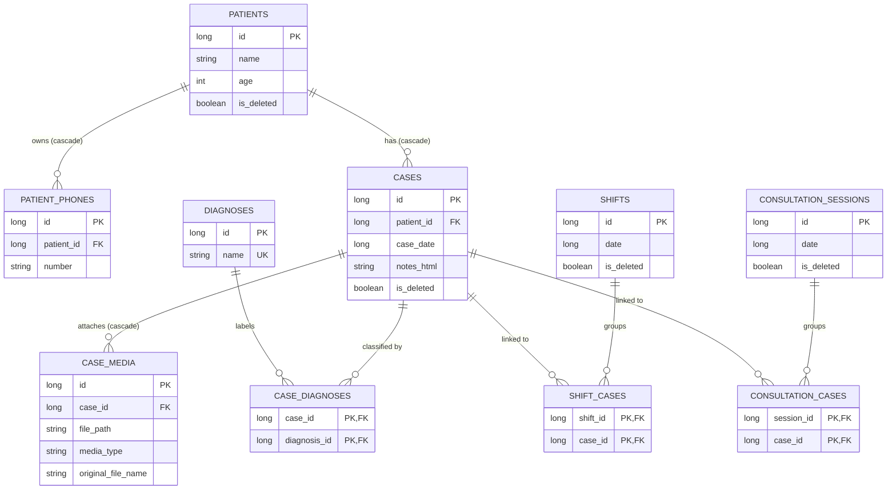

# Database Relationships

> **In plain words** — the database tables and how they connect. This is an **ER diagram**; the crow's-foot notation on a line means "many". `||--o{` therefore reads "one on the left, many on the right" — one patient has many cases. Tables whose name joins two others (`CASE_DIAGNOSES`, `SHIFT_CASES`, `CONSULTATION_CASES`) are *junction tables*: each row is one link, which is how "many-to-many" is expressed. "Cascade" means deleting the parent row removes its children automatically. See [[Learn/Databases And Room|Databases And Room]].

All foreign keys shown use cascade deletion. User-facing deletion is normally soft deletion; hard deletion is deferred to retention cleanup. The current Room schema is version 2.

See [[Layers/Local Storage|Local Storage]], [[Execution Flows/Database Operations|Database Operations]], and [[Components/Databases/KairosDatabase|KairosDatabase]].

## Source references

- `data/src/main/java/com/taha/kairos/data/db/KairosDatabase.kt`
- `data/src/main/java/com/taha/kairos/data/db/entities/PatientEntities.kt`
- `data/src/main/java/com/taha/kairos/data/db/entities/CaseEntities.kt`
- `data/src/main/java/com/taha/kairos/data/db/entities/DiagnosisEntities.kt`
- `data/src/main/java/com/taha/kairos/data/db/entities/ShiftEntities.kt`
- `data/src/main/java/com/taha/kairos/data/db/entities/ConsultationEntities.kt`
