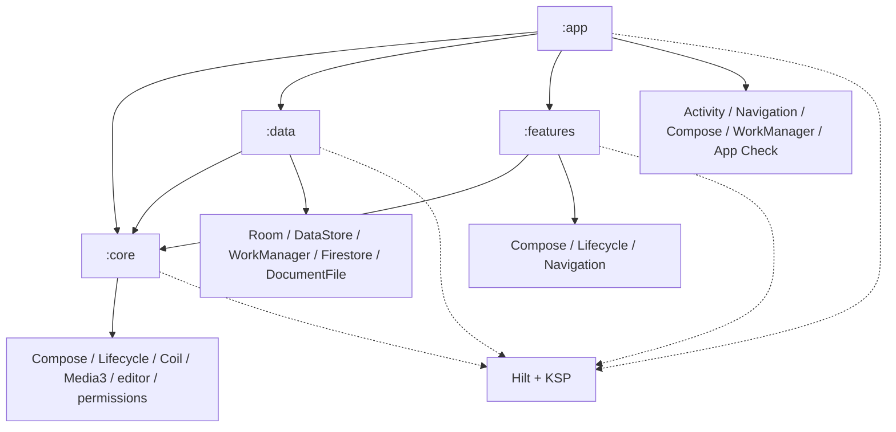

# Dependency Graph

> **In plain words** — who is allowed to use whom. An arrow from A to B means "A depends on B", so A can use B's code but B knows nothing about A. Dependencies must never form a circle; this graph is deliberately a one-way tree with `:core` at the bottom. See [[Learn/Gradle And Modules|Gradle And Modules]].

Solid module arrows are declared project dependencies. Hilt's generated graph is assembled in `:app`; repository interfaces in `:core` prevent a `:features` → `:data` edge.

See [[Overview/Dependencies|Dependencies]] and [[Architecture/Dependency Injection|Dependency Injection]].

## Source references

- `settings.gradle.kts`
- `app/build.gradle.kts`
- `core/build.gradle.kts`
- `data/build.gradle.kts`
- `features/build.gradle.kts`
- `gradle/libs.versions.toml`

