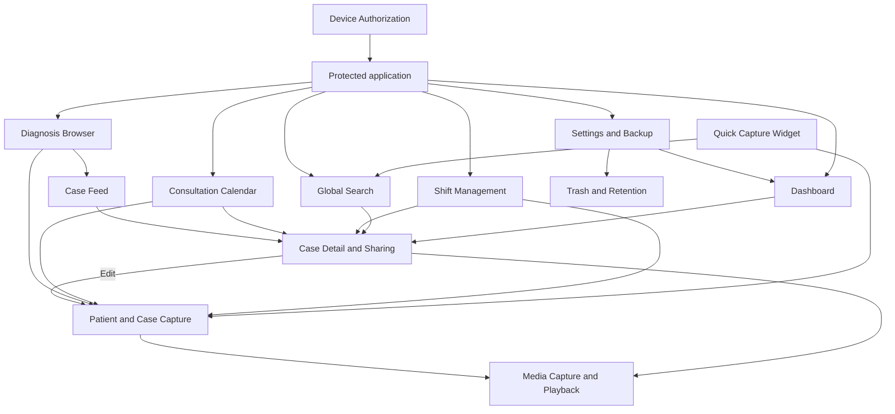

# Feature Relationships

> **In plain words** — which features lead into which, from the user's point of view rather than the code's. Useful for seeing that almost everything eventually flows into case capture or case detail, and that device authorization sits in front of all of it. See [[Features/Features Index|Features]].

Arrows represent navigation or an observable product dependency. For example, backup status configured in Settings is surfaced by Dashboard, while all case-discovery paths converge on Case Detail.

See [[Features/Features Index|Features]] and [[Diagrams/Navigation Graph|Navigation Graph]].

## Source references

- `app/src/main/java/com/taha/kairos/navigation/KairosNavHost.kt`
- `app/src/main/java/com/taha/kairos/widget/QuickCaptureWidgetProvider.kt`
- `features/src/main/java/com/taha/kairos/features/dashboard/DashboardViewModel.kt`
- `features/src/main/java/com/taha/kairos/features/patient/PatientCaseViewModel.kt`
- `features/src/main/java/com/taha/kairos/features/settings/SettingsViewModel.kt`

