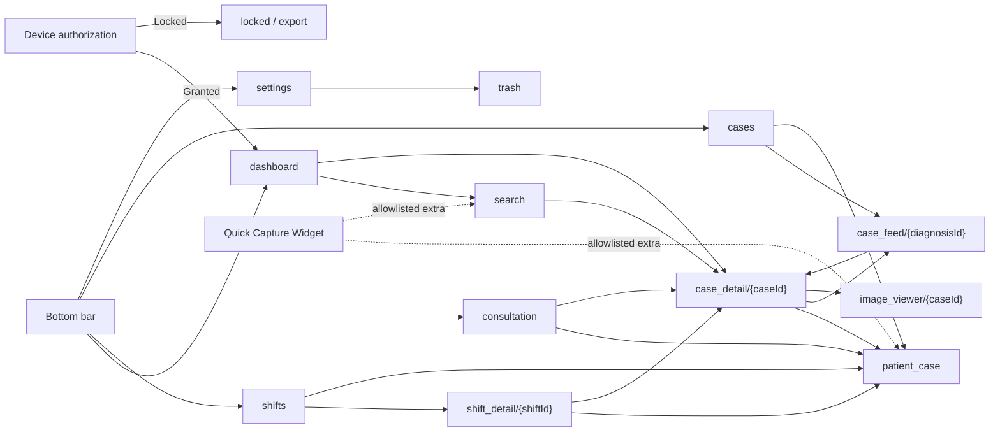

# Navigation Graph

> **In plain words** — the map of screens and the paths between them. Each box is a *route* (a screen's text address); `{caseId}` marks a value carried in the address. Everything hangs off the authorization gate, because when locked no screen exists at all. See [[Architecture/Navigation|Navigation]].

All non-top-level destinations pop back. `patient_case` adds optional shift, session, or edit-case IDs; `case_feed` adds an encoded diagnosis name; the viewer adds an optional initial index.

See [[Architecture/Navigation|Navigation]] and [[Execution Flows/Navigation Flow|Navigation Flow]].

## Source references

- `app/src/main/java/com/taha/kairos/MainActivity.kt`
- `app/src/main/java/com/taha/kairos/navigation/Destinations.kt`
- `app/src/main/java/com/taha/kairos/navigation/KairosNavHost.kt`
- `app/src/main/java/com/taha/kairos/widget/QuickCaptureWidgetProvider.kt`

