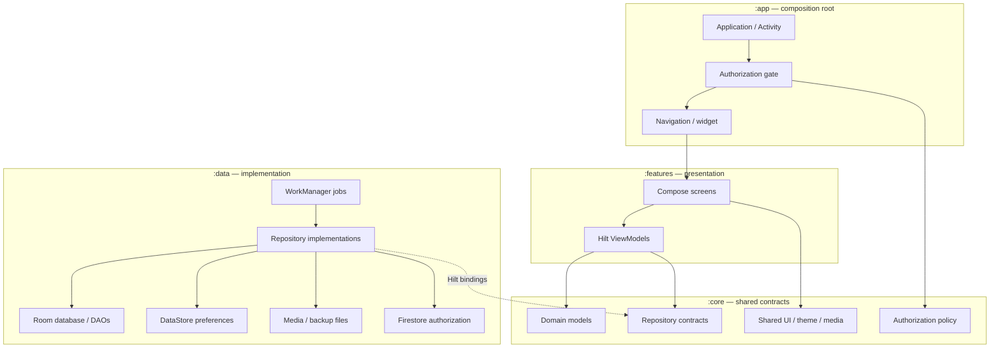

# Project Architecture

> **In plain words** — the whole app on one page. Each box grouping is a Gradle module; arrows point from something to what it depends on. The shape to notice: `:features` and `:data` never point at each other, only at `:core`. That gap is the architecture — screens and storage meet only through shared contracts. See [[Learn/Gradle And Modules|Gradle And Modules]].

The diagram shows compile-time ownership and runtime calls together. See [[Overview/Architecture|Architecture]], [[Overview/Gradle Modules|Gradle Modules]], and [[Layers/Layers Index|Layers]].

## Source references

- `settings.gradle.kts`
- `app/src/main/java/com/taha/kairos/MainActivity.kt`
- `core/src/main/java/com/taha/kairos/core/repository/CaseRepository.kt`
- `data/src/main/java/com/taha/kairos/data/di/DataModule.kt`
- `features/src/main/java/com/taha/kairos/features/patient/PatientCaseViewModel.kt`

