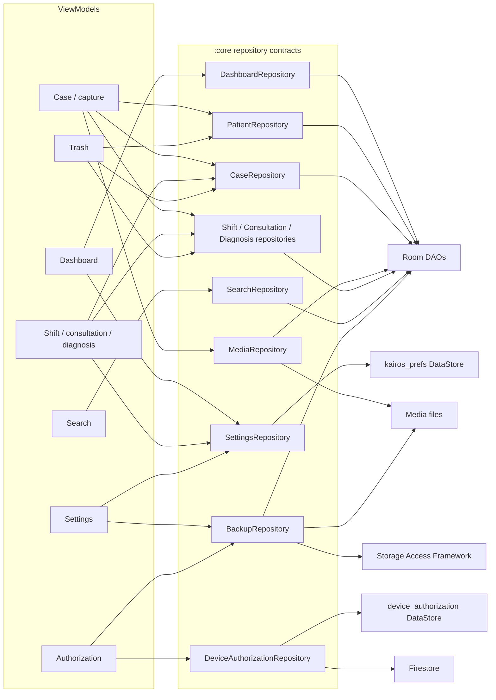

# Repository Interactions

> **In plain words** — which ViewModels use which repositories, and which storage each repository touches. Read it to answer "if I change this repository, what breaks?" — every ViewModel with an arrow into it. Note that several ViewModels share the same repository; that is fine, because a repository is a singleton with no per-screen state. See [[Layers/Repositories|Repositories]].

Hilt binds each contract to its data implementation. Room-backed writes and backup-sensitive file operations coordinate through `DataSafetyCoordinator`.

See [[Layers/Repositories|Repositories]], [[Architecture/Data Flow|Data Flow]], and [[Components/Repositories/Repositories Index|Repository components]].

## Source references

- `data/src/main/java/com/taha/kairos/data/di/DataModule.kt`
- `features/src/main/java/com/taha/kairos/features/patient/PatientCaseViewModel.kt`
- `features/src/main/java/com/taha/kairos/features/settings/SettingsViewModel.kt`
- `app/src/main/java/com/taha/kairos/authorization/AuthorizationGateViewModel.kt`
- `data/src/main/java/com/taha/kairos/data/repository/CaseRepositoryImpl.kt`
- `data/src/main/java/com/taha/kairos/data/backup/BackupEngine.kt`
