# ViewModel Interactions

> **In plain words** — the important fact is stated in the first line below: ViewModels never talk to each other. If deleting a case on one screen must update a count on another, that does not happen by one ViewModel calling another; both are subscribed to the same database, so the change reaches both independently. Shared state through a shared source, never through direct calls — that is what keeps features from becoming entangled. See [[Learn/Architecture Patterns|Architecture Patterns]].

ViewModels do not call one another. A screen owns or obtains its destination-scoped ViewModel; shared repository Flows propagate changes between otherwise independent features.

```mermaid
flowchart TB
    AuthScreen["Authorization gate"] --> AuthVM["AuthorizationGateViewModel"]
    DashboardScreen --> DashboardVM
    SearchScreen --> SearchVM
    ShiftsScreen --> ShiftsVM
    ShiftDetailScreen --> ShiftDetailVM
    ConsultationScreen --> ConsultationVM
    DiagnosisScreen --> DiagnosisVM
    CaseFeedScreen --> CaseFeedVM
    CaseDetailScreen --> CaseDetailVM
    ImageViewerScreen --> CaseDetailVM2["CaseDetailViewModel (viewer destination)"]
    PatientCaseScreen --> PatientCaseVM
    SettingsScreen --> SettingsVM
    TrashScreen --> TrashVM

    AuthVM --> AuthRepos["Authorization + Backup repositories"]
    DashboardVM --> DashboardRepos["Dashboard + Settings repositories"]
    SearchVM --> SearchRepo["SearchRepository"]
    ShiftsVM --> ShiftRepo["ShiftRepository"]
    ShiftDetailVM --> ShiftCaseRepos["Shift + Case repositories"]
    ConsultationVM --> ConsultationRepos["Settings + Consultation + Case repositories"]
    DiagnosisVM --> DiagnosisRepo["DiagnosisRepository"]
    CaseFeedVM --> CaseRepo["CaseRepository"]
    CaseDetailVM --> DetailRepos["Case + Media repositories"]
    CaseDetailVM2 --> DetailRepos
    PatientCaseVM --> CaptureRepos["Patient + Case + Diagnosis + Media repositories"]
    SettingsVM --> SettingsRepos["Settings + Backup repositories"]
    TrashVM --> TrashRepos["Patient + Case + Shift + Consultation repositories"]

    SharedStore["Shared Room / DataStore state"] -. "Flow emissions" .-> DashboardRepos
    SharedStore -.-> SearchRepo
    SharedStore -.-> ShiftCaseRepos
    SharedStore -.-> ConsultationRepos
    SharedStore -.-> DiagnosisRepo
    SharedStore -.-> CaseRepo
    SharedStore -.-> DetailRepos
    SharedStore -.-> SettingsRepos
    SharedStore -.-> TrashRepos
```

Navigation callbacks are owned by screens, not ViewModels. Detail IDs come from `SavedStateHandle`; patient-case optional IDs are parsed by the navigation host and passed to the screen/action.

See [[Architecture/State Management|State Management]], [[Execution Flows/State Updates|State Updates]], and [[Components/ViewModels/ViewModels Index|ViewModel components]].

## Source references

- `app/src/main/java/com/taha/kairos/authorization/AuthorizationGateViewModel.kt`
- `features/src/main/java/com/taha/kairos/features/dashboard/DashboardViewModel.kt`
- `features/src/main/java/com/taha/kairos/features/consultation/ConsultationViewModel.kt`
- `features/src/main/java/com/taha/kairos/features/patient/PatientCaseViewModel.kt`
- `features/src/main/java/com/taha/kairos/features/settings/TrashViewModel.kt`
- `app/src/main/java/com/taha/kairos/navigation/KairosNavHost.kt`
