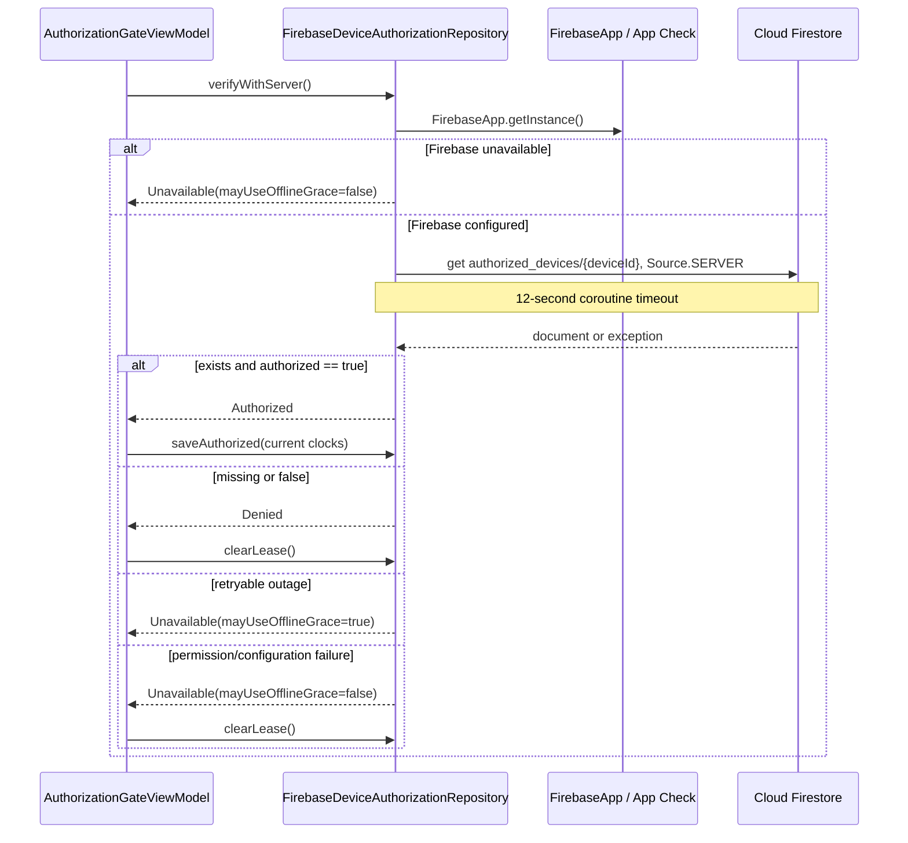

# API Request Lifecycle

> **In plain words** — the life of the app's single network request. The device asks Firestore for one document named after its device ID; App Check attaches proof that the request came from a genuine install; the read is forced to come from the server (not a stale local cache) and is abandoned after 12 seconds. Access is granted only on an explicit `authorized = true`. Every other outcome is classified as either "retryable, so offline grace may continue" or "not retryable, so lock". See [[Learn/Security And Privacy Basics|Security And Privacy Basics]].

The only application API request is device authorization through the Firestore SDK; there is no REST client and no clinical-data API.

Debug builds attach the App Check debug provider; release builds attach Play Integrity. Firestore caching is bypassed with `Source.SERVER`. Cancellation propagates, while timeout and SDK errors are converted to `RemoteAuthorizationResult`.

Retryable/graceable Firestore codes include deadline exceeded, resource exhausted, aborted, internal, unavailable, and unknown. Invalid argument, failed precondition, permission denied, and unauthenticated are non-graceable.

See [[Components/APIs/Firebase Authorization API|Firebase Authorization API]], [[Execution Flows/Login Flow|Login Flow]], and [[Layers/Networking|Networking]].

## Source references

- `data/src/main/java/com/taha/kairos/data/authorization/FirebaseDeviceAuthorizationRepository.kt`
- `core/src/main/java/com/taha/kairos/core/authorization/AuthorizationModels.kt`
- `app/src/debug/java/com/taha/kairos/FirebaseAppCheckInitializer.kt`
- `app/src/release/java/com/taha/kairos/FirebaseAppCheckInitializer.kt`
- `firestore.rules`

