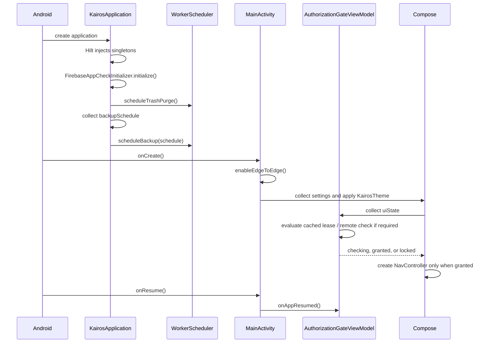

# App Startup

> **In plain words** — everything that happens between tapping the icon and seeing the dashboard. Order: Android creates the process → the `Application` object runs its one-time setup (attestation, background job scheduling) → `MainActivity` is created → the theme is applied → the authorization gate evaluates the stored lease → only if access is granted is the navigation graph built and the dashboard drawn. Note that last point: while checking or locked, the app's real screens are never created at all. See [[Learn/Android App Basics|Android App Basics]].

The launch/checking screen remains visible for at least 1.5 seconds so the device ID can be read. If access is granted, `AuthorizedAppContent()` creates the navigation host at `dashboard`; otherwise the locked screen offers retry and emergency export.

WorkManager startup is customized: the manifest removes its default initializer, and `KairosApplication.workManagerConfiguration` supplies `HiltWorkerFactory`.

Related: [[Architecture/Application Lifecycle|Application Lifecycle]], [[Execution Flows/Login Flow|Login Flow]], and [[Components/ViewModels/AuthorizationGateViewModel|AuthorizationGateViewModel]].

## Source references

- `app/src/main/AndroidManifest.xml`
- `app/src/main/java/com/taha/kairos/KairosApplication.kt`
- `app/src/main/java/com/taha/kairos/MainActivity.kt`
- `app/src/main/java/com/taha/kairos/authorization/AuthorizationGateViewModel.kt`
- `data/src/main/java/com/taha/kairos/data/backup/WorkerScheduler.kt`

