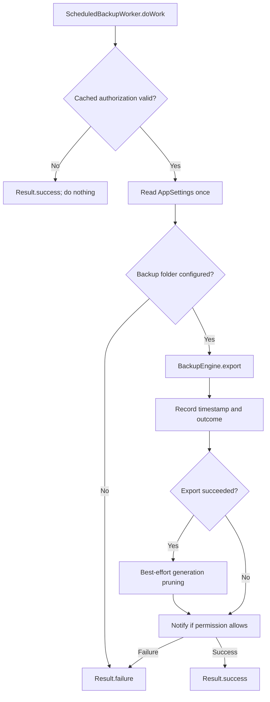

# Background Jobs

> **In plain words** — how the scheduled backup and the trash purge are registered and what they do when they run. *Unique work* means the job is registered under a name so it can never be queued twice. The two policies differ on purpose: `KEEP` leaves an existing registration alone (the purge job should just keep running), while `UPDATE` replaces it (a changed backup schedule must take effect). Both jobs check authorization first and quietly do nothing if the app is locked. See [[Architecture/Background Work|Background Work]].

## Registration

1. `KairosApplication.onCreate()` calls `scheduleTrashPurge()`.
2. The application collects `backupSchedule.distinctUntilChanged()`.
3. `OFF` cancels scheduled backup; other values enqueue unique periodic work with `UPDATE`.
4. Trash purge is unique daily work with `KEEP`.

## Scheduled Backup

## Trash Purge

After the same authorization guard, the worker takes `DataSafetyCoordinator`, computes a 30-day threshold, records media paths, hard-deletes expired database rows, purges other soft-deleted entities and orphan diagnoses, then removes files and unreferenced media best-effort.

Both jobs require battery not low and rely on the next periodic run rather than requesting immediate retry. See [[Architecture/Background Work|Background Work]].

## Source references

- `app/src/main/java/com/taha/kairos/KairosApplication.kt`
- `data/src/main/java/com/taha/kairos/data/backup/WorkerScheduler.kt`
- `data/src/main/java/com/taha/kairos/data/backup/ScheduledBackupWorker.kt`
- `data/src/main/java/com/taha/kairos/data/backup/TrashPurgeWorker.kt`
- `data/src/main/java/com/taha/kairos/data/authorization/CachedAuthorizationGuard.kt`
