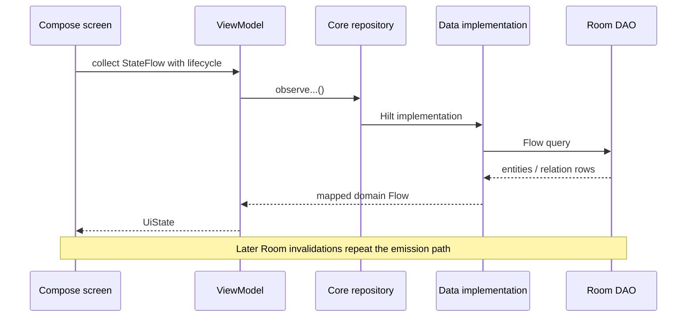

# Data Loading

> **In plain words** — how data gets from the database onto the screen. It is a **subscription, not a fetch**: the screen subscribes once, and the database pushes a new value every time the underlying tables change. The chain is always the same — DAO query → repository (which converts database shapes into app shapes) → ViewModel (which converts app shapes into screen state) → Compose. Understand this one chain and every list in the app becomes predictable. Beginner walkthrough with real code: [[Learn/Code Tour One Feature|Code Tour One Feature]].

## Reactive Lists and Details

Examples include case detail by ID, cases by diagnosis/shift/session, shifts, trash, dashboard totals, consultation ranges, and settings. `stateIn(WhileSubscribed(5_000))` keeps most streams warm briefly across UI lifecycle changes.

## Search

`SearchViewModel` debounces text for 250 ms and switches to `SearchRepository.observeSearch()`. The implementation chooses the longest token as the SQL anchor, observes matching case rows, then requires all normalized tokens in Kotlin and limits output to 50.

## One-Shot Reads

Commands use suspending reads where a stream is unnecessary: loading an editable case, resolving a patient, getting/creating diagnoses or sessions, counting dashboard periods, and reading settings once inside a worker.

Mapping details are in [[Layers/Mappers|Mappers]]; concrete repository boundaries are in [[Layers/Repositories|Repositories]] and [[Diagrams/Repository Interactions|Repository Interactions]].

## Source references

- `features/src/main/java/com/taha/kairos/features/cases/CaseDetailViewModel.kt`
- `features/src/main/java/com/taha/kairos/features/search/SearchViewModel.kt`
- `data/src/main/java/com/taha/kairos/data/repository/SearchRepositoryImpl.kt`
- `data/src/main/java/com/taha/kairos/data/repository/CaseRepositoryImpl.kt`
- `data/src/main/java/com/taha/kairos/data/repository/SettingsRepositoryImpl.kt`

