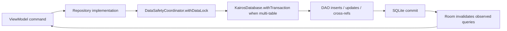

# Database Operations

> **In plain words** — reads and writes at the database level. Reads return either plain rows, aggregates (a case together with its patient, diagnoses, and media), counts, or live subscriptions. Writes are wrapped: first the global data lock where needed, then a **transaction**, so a multi-table save either lands completely or leaves nothing behind. Deletes are marks, not removals. See [[Learn/Databases And Room|Databases And Room]].

## Read

Room DAOs return entities, relation aggregates, count rows, and invalidation-aware Flows. Repository implementations map these to `:core` domain models; case mapping also resolves stored relative media paths to absolute app-local paths.

## Write

- Patient upsert replaces phone rows in one Room transaction.
- Case upsert creates/updates the case, rebuilds diagnosis cross-references, and optionally links shift or consultation session.
- Media batch editing validates primary-media invariants and coordinates rows with file deletion.
- Deletes are normally soft deletes. Restore clears deletion state; the purge worker performs hard deletion after 30 days.

## Schema and Backup Coordination

`KairosDatabase` is version 2. `MIGRATION_1_2` adds `case_media.original_file_name`; explicit migrations are registered in `DatabaseModule`.

Backup, restore, vacuum, protected repository writes, and purge share a re-entrant coroutine-aware `DataSafetyCoordinator`. Export checkpoints the WAL before copying the database and media; restore validates into a staging area before replacement.

See [[Layers/Local Storage|Local Storage]], [[Diagrams/Database Relationships|Database Relationships]], and [[Components/Databases/KairosDatabase|KairosDatabase]].

## Source references

- `data/src/main/java/com/taha/kairos/data/db/KairosDatabase.kt`
- `data/src/main/java/com/taha/kairos/data/db/migrations/Migrations.kt`
- `data/src/main/java/com/taha/kairos/data/repository/PatientRepositoryImpl.kt`
- `data/src/main/java/com/taha/kairos/data/repository/CaseRepositoryImpl.kt`
- `data/src/main/java/com/taha/kairos/data/repository/MediaRepositoryImpl.kt`
- `data/src/main/java/com/taha/kairos/data/backup/DataSafetyCoordinatorImpl.kt`
- `data/src/main/java/com/taha/kairos/data/backup/BackupEngine.kt`
