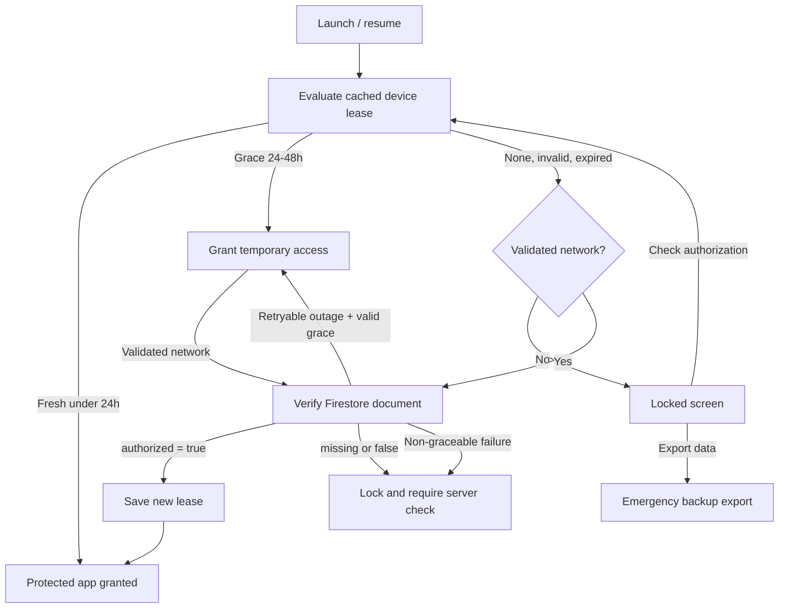

# Login Flow

> **In plain words** — there is no login. The equivalent step is the device check. Read the diagram as a decision tree: is the stored lease fresh (under 24h)? Open the app. In grace (24–48h)? Open it, and refresh in the background if there is a connection. Otherwise, is there a validated internet connection? If yes, ask the server; if no, lock. Every uncertain branch ends in *locked*, which is the fail-closed rule in visual form. See [[Learn/Security And Privacy Basics|Security And Privacy Basics]].

Kairos has no user account or credential login. The equivalent entry flow is device authorization against a Firestore whitelist.

## Lease Rules

1. `AuthorizationClock` captures wall time, elapsed realtime, and boot count.
2. `AuthorizationLeasePolicy.evaluate()` rejects device mismatch, malformed timestamps, reboot, elapsed-time reversal, and wall-clock rollback beyond five minutes.
3. A fresh lease grants 24 hours locally. The next 24 hours are grace while the app attempts a refresh.
4. At 48 hours, or after reboot, a positive online response is mandatory.
5. Denial and non-graceable failure clear timestamps and persist `requires_server_check`.

`NetworkMonitor` requires a validated internet capability, not merely a connected network. The foreground gate owns remote renewal; workers only inspect cached access through `CachedAuthorizationGuard`.

Related: [[Features/Device Authorization|Device Authorization]], [[Execution Flows/API Request Lifecycle|API Request Lifecycle]], and [[Diagrams/API Flow|API Flow]].

## Source references

- `core/src/main/java/com/taha/kairos/core/authorization/AuthorizationLeasePolicy.kt`
- `core/src/main/java/com/taha/kairos/core/authorization/AuthorizationModels.kt`
- `app/src/main/java/com/taha/kairos/authorization/AuthorizationGateViewModel.kt`
- `app/src/main/java/com/taha/kairos/authorization/AuthorizationClock.kt`
- `app/src/main/java/com/taha/kairos/authorization/NetworkMonitor.kt`
- `data/src/main/java/com/taha/kairos/data/authorization/FirebaseDeviceAuthorizationRepository.kt`

