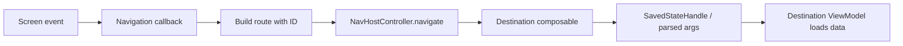

# Navigation Flow

> **In plain words** — the mechanics of moving between screens. A screen never navigates by itself; it invokes a callback, `KairosNavHost` builds a route containing an **ID**, and the destination looks the record up again. Passing IDs rather than whole records is deliberate: the destination always shows current data, and no stale copy can travel between screens. Back goes through the *back stack*, a list of where you have been; tab switching saves and restores each tab's position instead of resetting it. See [[Architecture/Navigation|Navigation]].

1. After authorization, `MainActivity` creates a `NavHostController` and `KairosNavHost` at `dashboard`.
2. Feature screens receive callbacks rather than the controller itself.
3. A callback constructs a route with an ID and calls `navigate()`; detail destinations use `SavedStateHandle` to reload current data.
4. Back actions call `popBackStack()`.
5. Top-level tab selection pops to the graph start while saving state, then restores the selected tab's state.

`patient_case` is reused for new records, an existing patient, a shift link, a consultation-session link, and editing. Optional IDs default to `-1` in the graph and are converted to null before reaching the screen.

The widget sets an activity extra rather than a URI deep link. `MainActivity` accepts only `patient_case` and `search`, waits for authorization, and navigates once.

See [[Architecture/Navigation|Navigation]], [[Diagrams/Navigation Graph|Navigation Graph]], and [[Features/Quick Capture Widget|Quick Capture Widget]].

## Source references

- `app/src/main/java/com/taha/kairos/MainActivity.kt`
- `app/src/main/java/com/taha/kairos/navigation/KairosNavHost.kt`
- `app/src/main/java/com/taha/kairos/navigation/Destinations.kt`
- `features/src/main/java/com/taha/kairos/features/shifts/ShiftDetailViewModel.kt`
- `features/src/main/java/com/taha/kairos/features/patient/PatientCaseScreen.kt`

