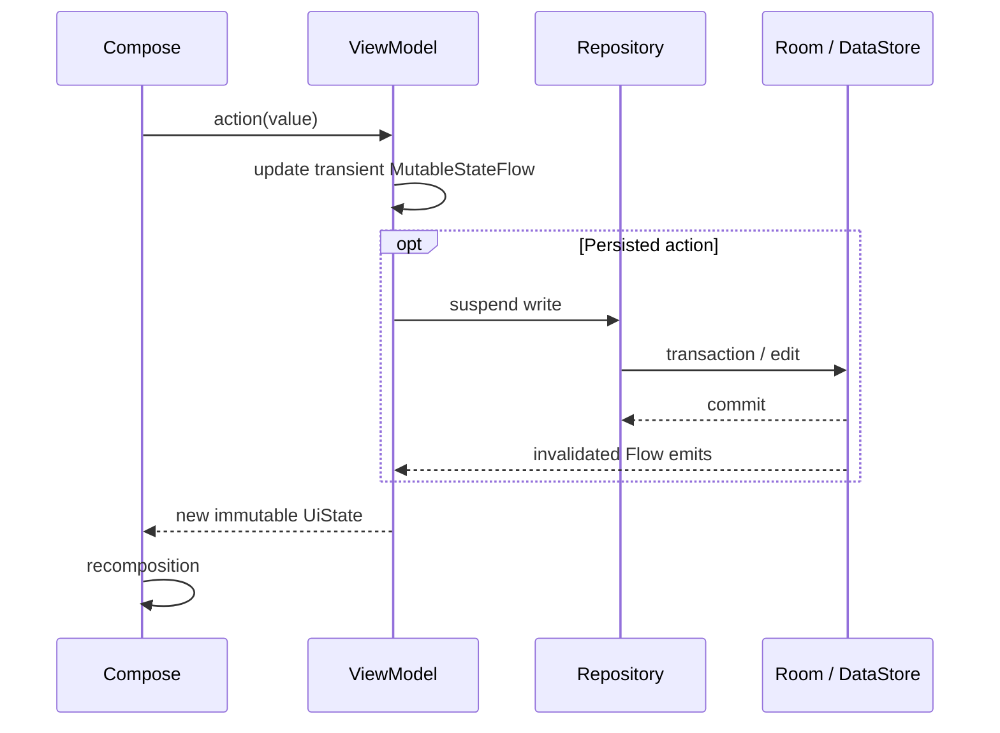

# State Updates

> **In plain words** — what happens between a tap and the screen changing. Crucially the screen is **not** updated directly. The ViewModel performs the write; the write changes the database; the database notifies the subscription; the new value becomes new screen state; Compose redraws the parts that differ. The long way round is the point — there is only ever one source of truth, so the screen cannot show something the database disagrees with. See [[Learn/Coroutines And Flow|Coroutines And Flow]].

## User-Driven Update

Form ViewModels update state immediately and persist on an explicit save. Reactive list/detail ViewModels derive state from repository Flows, so writes made elsewhere appear without direct ViewModel coordination.

## One-Shot Effects

Snackbars and share/navigation signals are represented as nullable messages, flags, or payloads in state. The screen performs the effect in `LaunchedEffect`, then calls a clear method. Successful patient/case save sets `saved = true`; the screen navigates back. Case sharing exposes a payload, lets the screen launch Android sharing, then clears it.

## Lifecycle

Screens collect through `collectAsStateWithLifecycle()`. `SharingStarted.WhileSubscribed(5_000)` prevents most upstream queries from running indefinitely with no active collector while tolerating brief recreation.

See [[Architecture/State Management|State Management]] and [[Diagrams/ViewModel Interactions|ViewModel Interactions]].

## Source references

- `features/src/main/java/com/taha/kairos/features/patient/PatientCaseViewModel.kt`
- `features/src/main/java/com/taha/kairos/features/patient/PatientCaseScreen.kt`
- `features/src/main/java/com/taha/kairos/features/cases/CaseDetailViewModel.kt`
- `features/src/main/java/com/taha/kairos/features/cases/CaseDetailScreen.kt`
- `features/src/main/java/com/taha/kairos/features/settings/SettingsViewModel.kt`

