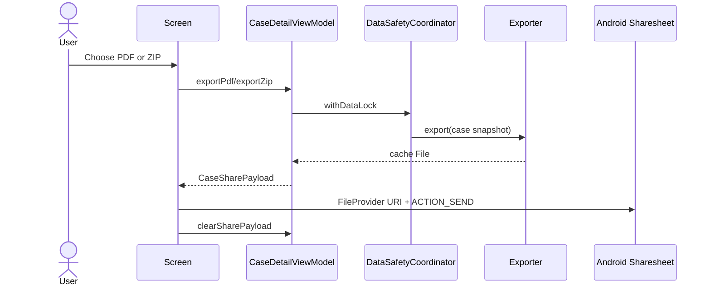

# Case Detail and Sharing

> **In plain words** — the read-only view of one complete case, plus the ability to edit it, move it to trash, or share it as a PDF or ZIP. The sharing part is instructive: the file is built on a background thread (so the screen never freezes), written into the app's cache folder, and then handed to other apps through a **FileProvider**, which exposes it as a temporary permissioned link rather than a raw file path. That is the safe way to share a file on Android. See [[Learn/Android App Basics|Android App Basics]].

## Purpose

Present the complete patient/case record and provide edit, soft-delete, attachment access, and portable PDF or ZIP sharing.

## User Flow

The user opens a case from dashboard, search, a shift, consultation, or diagnosis feed. They can dial a stored phone, open a diagnosis feed, inspect media, open a file, delete audio/files, edit the aggregate, move the case to trash, or share PDF/ZIP.

## Execution Flow

`CaseDetailViewModel` reads `caseId`, observes the aggregate, and combines it with an independent share-export state. Export captures the current case snapshot, enters the data-safety lock, creates a cache file on `Dispatchers.IO`, then exposes a one-shot `CaseSharePayload`. The screen converts it to a FileProvider URI and launches `ACTION_SEND`.

## Important Classes

- `CaseDetailScreen` and `CaseDetailViewModel`.
- `CasePdfExporter`, `CaseZipExporter`, `CaseArchiveWriter`, and `CaseShareFiles` utilities.
- `CaseSharePayload`, `FileProvider`, `AudioPlayerItem`, and shared media models.

## Related ViewModels

- [[Components/ViewModels/CaseDetailViewModel|CaseDetailViewModel]]
- [[Components/ViewModels/PatientCaseViewModel|PatientCaseViewModel]]
- [[Components/ViewModels/CaseFeedViewModel|CaseFeedViewModel]]

## Related Repositories

- [[Components/Repositories/CaseRepository|CaseRepository]]
- [[Components/Repositories/MediaRepository|MediaRepository]]
- [[Components/Repositories/DataSafetyCoordinator|DataSafetyCoordinator]]

## API Calls

- Local repository calls: `observeById`, `softDelete`, `delete`, and `setPrimary`.
- Android integrations: `ACTION_DIAL`, `ACTION_VIEW`, `ACTION_SEND`, sharesheet, and FileProvider URI grants.
- No HTTP API is called.

## State Flow

`CaseDetailUiState` combines the observed `Case?` with `ShareExportState` (`isExporting`, payload, message). Payload and message are consumed by screen effects and explicitly cleared.

## Navigation

- Route: `case_detail/{caseId}`.
- Edit: `patient_case?caseId={caseId}`.
- Diagnosis chip: `case_feed/{diagnosisId}?name={encodedName}`.
- Visual media: `image_viewer/{caseId}?index={index}`.
- Soft-delete completes by popping the current route.

## Design Decisions

- PDF includes clinical text and photos; ZIP contains a photo-free report plus every readable attachment, grouped by media type.
- ZIP source paths are canonicalized under the managed media root. Missing attachments are skipped and listed without leaking paths.
- Output uses unique names, `.partial` staging, best-effort atomic publish, cancellation checks, and 24-hour cache pruning.
- Notes are rendered/exported as plain text. PDF photo decoding is sampled to bound memory.
- Audio/file deletion is immediate and unconfirmed; visual deletion is performed through the editor.
- A missing case produces a blank detail body, and most delete/media failures are not surfaced. `setPrimaryMedia` has no current detail-screen caller.

## Related Pages

- [[Features/Patient and Case Capture|Patient and Case Capture]]
- [[Features/Media Capture and Playback|Media Capture and Playback]]
- [[Features/Case Feed|Case Feed]]
- [[Architecture/Error Handling]]
- [[Execution Flows/API Request Lifecycle]]

## Source references

- `features/src/main/java/com/taha/kairos/features/cases/CaseDetailScreen.kt`
- `features/src/main/java/com/taha/kairos/features/cases/CaseDetailViewModel.kt`
- `features/src/main/java/com/taha/kairos/features/cases/CasePdfExporter.kt`
- `features/src/main/java/com/taha/kairos/features/cases/CaseZipExporter.kt`
- `features/src/main/java/com/taha/kairos/features/cases/CaseShareFiles.kt`
- `app/src/main/res/xml/file_paths.xml`
- `core/src/main/java/com/taha/kairos/core/repository/CaseRepository.kt`
- `core/src/main/java/com/taha/kairos/core/repository/MediaRepository.kt`
