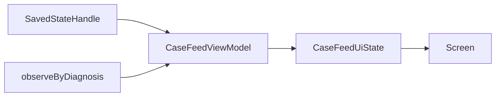

# Case Feed

> **In plain words** — the list you get after tapping a diagnosis: every active case tagged with it. This is the simplest complete feature in the app, which is exactly why it is used as the teaching example in [[Learn/Code Tour One Feature|Code Tour One Feature]] — one screen, one ViewModel, one repository call, one SQL query with a join, traced end to end.

## Purpose

Show all active cases associated with one diagnosis.

## User Flow

The user selects a diagnosis in [[Features/Diagnosis Browser|Diagnosis Browser]] or from a diagnosis chip in case detail, reviews the matching case cards, opens a case, or returns to the previous screen.

## Execution Flow

`CaseFeedViewModel` reads `diagnosisId` and `diagnosisName` from `SavedStateHandle`. A valid ID selects `CaseRepository.observeByDiagnosis`; each emission becomes `CaseFeedUiState`. An absent ID produces an empty non-loading state.

## Important Classes

- `CaseFeedScreen` — title, empty state, and `CaseCard` list.
- `CaseFeedViewModel` and `CaseFeedUiState`.
- Shared `CaseCard` and domain `Case`.

## Related ViewModels

- [[Components/ViewModels/CaseFeedViewModel|CaseFeedViewModel]]
- [[Components/ViewModels/DiagnosisBrowseViewModel|DiagnosisBrowseViewModel]]
- [[Components/ViewModels/CaseDetailViewModel|CaseDetailViewModel]]

## Related Repositories

- [[Components/Repositories/CaseRepository|CaseRepository]]

## API Calls

The sole data call is local `CaseRepository.observeByDiagnosis(diagnosisId)`; no network API is involved.

## State Flow

State begins loading and is shared with `SharingStarted.WhileSubscribed(5_000)`.

## Navigation

- Route: `case_feed/{diagnosisId}?name={diagnosisName}`.
- Case card: `case_detail/{caseId}`.
- Back: pop the current route.

## Design Decisions

- The title uses the route-provided diagnosis name snapshot; an in-place rename elsewhere does not update an already open feed title.
- The feed is read-only and has no add action.
- A missing route ID silently renders an empty feed; repository errors are not represented in UI state.

## Related Pages

- [[Features/Diagnosis Browser|Diagnosis Browser]]
- [[Features/Case Detail and Sharing|Case Detail and Sharing]]
- [[Architecture/Navigation]]

## Source references

- `features/src/main/java/com/taha/kairos/features/cases/CaseFeedScreen.kt`
- `features/src/main/java/com/taha/kairos/features/cases/CaseFeedViewModel.kt`
- `core/src/main/java/com/taha/kairos/core/repository/CaseRepository.kt`
- `app/src/main/java/com/taha/kairos/navigation/KairosNavHost.kt`
