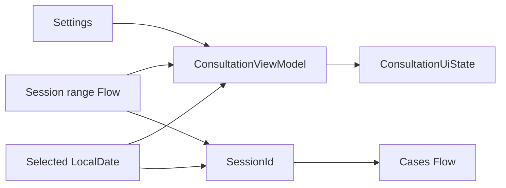

# Consultation Calendar

> **In plain words** — a date strip built around one configured weekday (Thursday by default), showing the cases seen in each consultation session. Two ideas worth noticing. **Lazy creation**: a session row is only created when a case is actually about to be added to it, so the database does not fill with hundreds of empty sessions. **Derived state**: the visible dates are computed from the setting plus a two-year window rather than stored, so changing the consultation weekday reshapes the whole calendar with no data migration.

## Purpose

Organize cases by a configured weekly consultation day and create a session only when a case is about to be added.

## User Flow

The user moves through the two-year date strip or previous/next consultation controls, reviews cases for the selected session, opens a case, or taps add on an eligible day to start linked patient/case capture.

## Execution Flow

`ConsultationViewModel` observes the configured weekday and all sessions from one year before to one year after ViewModel creation. It constructs `DateItem` entries for every date, derives the selected session, then switches `CaseRepository.observeBySession` when the selected session changes. Add calls `getOrCreateForDate` before navigation.

## Important Classes

- `ConsultationCalendarScreen` and `DateCell`.
- `ConsultationViewModel`, `ConsultationUiState`, and `DateItem`.
- `ConsultationSession` and `Case`.

## Related ViewModels

- [[Components/ViewModels/ConsultationViewModel|ConsultationViewModel]]
- [[Components/ViewModels/PatientCaseViewModel|PatientCaseViewModel]]

## Related Repositories

- [[Components/Repositories/ConsultationRepository|ConsultationRepository]]
- [[Components/Repositories/CaseRepository|CaseRepository]]
- [[Components/Repositories/SettingsRepository|SettingsRepository]]

## API Calls

All calls are local: `observeSettings()`, `observeForDateRange(start, end)`, `observeBySession(sessionId)`, and `getOrCreateForDate(dateMillis)`. Saving the new case later calls `upsertCase(..., linkSessionId)`.

## State Flow

`ui` and `cases` are separate `StateFlow` values using `SharingStarted.WhileSubscribed(5_000)`.

## Navigation

- Top-level route: `consultation`.
- Add: `patient_case?sessionId={sessionId}` after lazy session creation.
- Case row: `case_detail/{caseId}`.

## Design Decisions

- Dates are normalized to system-zone start-of-day epoch milliseconds.
- Non-consultation dates remain visible but faded and non-clickable.
- The initial selected date is today even when today is not the configured consultation day; previous/next finds the nearest valid weekday.
- The range is fixed at ViewModel construction and the full date list is rebuilt on relevant emissions.
- A settings change restarts the same session-range observation.
- Session soft-delete and case/session unlink operations exist in repositories but have no current consultation UI action.

## Related Pages

- [[Features/Patient and Case Capture|Patient and Case Capture]]
- [[Features/Settings and Backup|Settings and Backup]]
- [[Architecture/Configuration]]
- [[Execution Flows/Data Loading]]

## Source references

- `features/src/main/java/com/taha/kairos/features/consultation/ConsultationCalendarScreen.kt`
- `features/src/main/java/com/taha/kairos/features/consultation/ConsultationViewModel.kt`
- `core/src/main/java/com/taha/kairos/core/repository/ConsultationRepository.kt`
- `core/src/main/java/com/taha/kairos/core/repository/CaseRepository.kt`
- `core/src/main/java/com/taha/kairos/core/repository/SettingsRepository.kt`
- `app/src/main/java/com/taha/kairos/navigation/KairosNavHost.kt`
