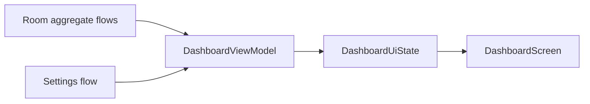

# Dashboard

> **In plain words** — the home screen: totals, this week versus last week, recent cases, and a warning if backups have not been running. Technically it is a good example of **combining** several live data streams into one screen state — patient count, case count, shift count, date-range counts, and settings all update independently, and the dashboard recomputes whenever any of them changes. Nothing is refreshed manually. See [[Learn/Coroutines And Flow|Coroutines And Flow]].

## Purpose

Provide an at-a-glance view of workload, recent cases, milestone progress, and backup health.

## User Flow

The authorized app opens on the dashboard. The user reviews patient/case/shift totals, compares the current week and month with the preceding periods, opens a recent case, or enters [[Features/Global Search|Global Search]].

## Execution Flow

`DashboardViewModel` combines reactive totals and recent cases. Every total-case emission also loads four date-range counts. Settings are evaluated into a backup warning, and an exact newly observed case milestone triggers a 2.5-second celebration.

## Important Classes

- `DashboardScreen` — cards, progress bar, recent rows, and search action.
- `DashboardViewModel` — aggregation, period boundaries, milestones, and warning policy.
- `DashboardUiState`, `MilestoneProgress`, and `RecentCase` — rendered state.

## Related ViewModels

- [[Components/ViewModels/DashboardViewModel|DashboardViewModel]]

## Related Repositories

- [[Components/Repositories/DashboardRepository|DashboardRepository]]
- [[Components/Repositories/SettingsRepository|SettingsRepository]]

## API Calls

There is no network call. The feature calls `observeTotalPatients()`, `observeTotalCases()`, `observeTotalShifts()`, `observeRecentCases()`, `countCasesInRange(startMs, endMs)`, and `observeSettings()`.

## State Flow

The public state is a `StateFlow` started with `SharingStarted.WhileSubscribed(5_000)` and begins with zero-valued cards.

## Navigation

- Start route: `dashboard`.
- Search icon: `search`.
- Recent case: `case_detail/{caseId}`.

## Design Decisions

- Week boundaries use Monday in the system time zone; month boundaries use calendar months.
- Milestones step by 10 below 100 cases, 50 below 500, then 100.
- Celebration occurs only when an observed total equals a milestone; jumping over a threshold does not celebrate it.
- Backup warnings use schedule-specific staleness limits: 3, 10, or 35 days for daily, weekly, or monthly schedules.
- The warning text says data exists on the phone but is not conditional on a nonzero patient count.

## Related Pages

- [[Features/Global Search|Global Search]]
- [[Features/Settings and Backup|Settings and Backup]]
- [[Architecture/State Management]]
- [[Execution Flows/Data Loading]]

## Source references

- `features/src/main/java/com/taha/kairos/features/dashboard/DashboardScreen.kt`
- `features/src/main/java/com/taha/kairos/features/dashboard/DashboardViewModel.kt`
- `core/src/main/java/com/taha/kairos/core/repository/DashboardRepository.kt`
- `core/src/main/java/com/taha/kairos/core/repository/SettingsRepository.kt`
- `app/src/main/java/com/taha/kairos/navigation/KairosNavHost.kt`
