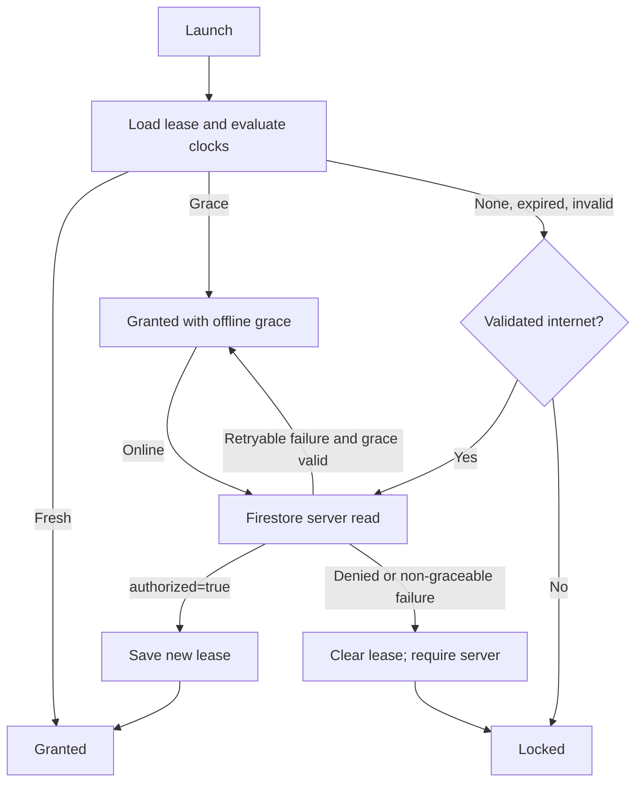

# Device Authorization

> **In plain words** — instead of a username and password, the app checks whether *this particular phone* is on an approved list held on a server. A successful check writes a **lease**: permission to keep working offline for 24 hours, with a further 24-hour grace period, after which a new check is required. The clever part is making that lease untamperable — age is measured with a clock the user cannot edit, a reboot cancels the offline lease, and turning the phone's clock back invalidates it. If anything is uncertain, the app **locks** rather than opening, but it always still allows a full data export so nobody loses their records. Full beginner explanation: [[Learn/Security And Privacy Basics|Security And Privacy Basics]].

## Purpose

Protect all patient-facing navigation behind a server-managed device whitelist. This is device authorization, not a user/password login system.

## User Flow

1. Launch shows the derived device ID for at least 1.5 seconds while the cached lease is evaluated.
2. A valid fresh or grace lease opens the app.
3. Otherwise, a validated internet connection triggers a Firestore check.
4. A denied or unverifiable device remains locked. The user can copy the device ID, retry, or export a recovery backup.

## Execution Flow

`MainActivity` creates `KairosNavHost` only while access is granted. `AuthorizationGateViewModel` serializes evaluations with a `Mutex`, schedules the next lease boundary, and re-evaluates on resume or when validated connectivity returns.

## Important Classes

- `AuthorizationGateViewModel` — state machine and boundary timers.
- `AuthorizationLeasePolicy` — pure fresh/grace/expired/invalid evaluation.
- `FirebaseDeviceAuthorizationRepository` — device identity, DataStore lease, and Firestore verification.
- `SystemAuthorizationClock` and `ConnectivityNetworkMonitor` — trusted clock snapshot and validated-network signal.
- `AuthorizationLaunchScreen` and `AuthorizationLockedScreen` — gate UI.

## Related ViewModels

- [[Components/ViewModels/AuthorizationGateViewModel|AuthorizationGateViewModel]]

## Related Repositories

- [[Components/Repositories/DeviceAuthorizationRepository|DeviceAuthorizationRepository]]
- [[Components/Repositories/BackupRepository|BackupRepository]]

## API Calls

- Firestore server-only read: `authorized_devices/{deviceId}`, accepted only when the document exists and Boolean `authorized` is `true`; timeout is 12 seconds.
- Locked-state export calls `BackupRepository.export(folderUri)` after an Android Storage Access Framework folder selection.
- Firebase App Check uses the debug provider in debug builds and Play Integrity in release builds.

## State Flow

`AuthorizationGateUiState` contains the immutable device ID, `AuthorizationAccessState` (`InitialChecking`, `Granted`, or `Locked`), and `AuthorizationExportState`. A sticky in-memory hard failure plus a durable `requires_server_check` marker prevents stale authorization from reopening the app.

## Navigation

The gate wraps all routes in `MainActivity`. Checking and locked states do not instantiate the navigation graph. Successful authorization opens [[Features/Dashboard|Dashboard]].

## Design Decisions

- Normal lease is 24 hours; offline grace extends the maximum to 48 hours.
- Same-boot elapsed realtime is authoritative. Reboot, structurally invalid time, or wall-clock rollback beyond five minutes invalidates offline access.
- Unexpected storage, clock, or authorization failures fail closed.
- Manual backup remains available while locked; protected data screens and mutation workers do not.
- The locked UI currently does not display the detailed lock reason or detailed export message carried in state.

## Related Pages

- [[Execution Flows/Login Flow]]
- [[Execution Flows/App Startup]]
- [[Architecture/Error Handling]]
- [[Architecture/Configuration]]

## Source references

- `app/src/main/java/com/taha/kairos/MainActivity.kt`
- `app/src/main/java/com/taha/kairos/authorization/AuthorizationGateViewModel.kt`
- `app/src/main/java/com/taha/kairos/authorization/AuthorizationScreens.kt`
- `app/src/main/java/com/taha/kairos/authorization/AuthorizationClock.kt`
- `app/src/main/java/com/taha/kairos/authorization/NetworkMonitor.kt`
- `core/src/main/java/com/taha/kairos/core/authorization/AuthorizationModels.kt`
- `core/src/main/java/com/taha/kairos/core/authorization/AuthorizationLeasePolicy.kt`
- `data/src/main/java/com/taha/kairos/data/authorization/FirebaseDeviceAuthorizationRepository.kt`
- `data/src/main/java/com/taha/kairos/data/authorization/CachedAuthorizationGuard.kt`
