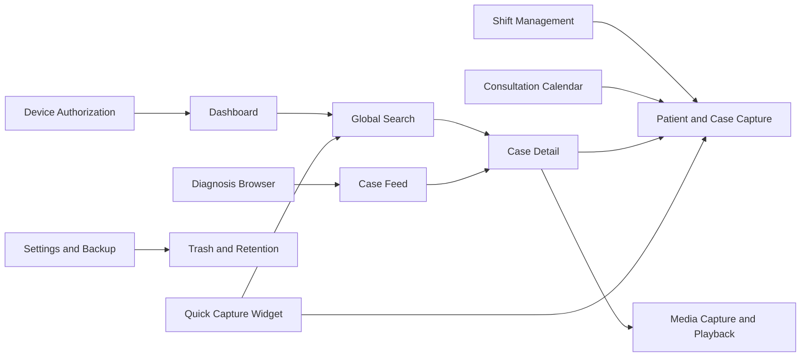

# Features

> **In plain words** — one page per thing the user can actually *do*. Each follows the same shape: **Purpose** (why it exists), **User Flow** (what the person does), **Execution Flow** (what the code does about it), then the classes involved. These are the best pages to read if you want to connect "the button I tap" to "the file that runs". If the Execution Flow sections read as jargon, work through [[Learn/Code Tour One Feature|Code Tour One Feature]] first — it traces one feature end to end at beginner pace.

Kairos is organized around local case capture, retrieval, scheduling, media, data safety, and a device-level authorization gate.

## Feature map

- [[Features/Device Authorization|Device Authorization]] — fail-closed device whitelist and locked-state recovery export.
- [[Features/Dashboard|Dashboard]] — aggregate workload, milestones, recent cases, and backup health.
- [[Features/Global Search|Global Search]] — case-centric search across patient and clinical fields.
- [[Features/Shift Management|Shift Management]] — create shifts, link cases, remove links, and recover deleted shifts.
- [[Features/Consultation Calendar|Consultation Calendar]] — consultation-day timeline and session-linked capture.
- [[Features/Diagnosis Browser|Diagnosis Browser]] — diagnosis index, sorting, creation, and rename.
- [[Features/Case Feed|Case Feed]] — all active cases associated with one diagnosis.
- [[Features/Case Detail and Sharing|Case Detail and Sharing]] — review, edit, delete, and export a case.
- [[Features/Patient and Case Capture|Patient and Case Capture]] — create or edit the patient/case aggregate.
- [[Features/Media Capture and Playback|Media Capture and Playback]] — photos, videos, audio, files, viewing, and gallery export.
- [[Features/Settings and Backup|Settings and Backup]] — runtime preferences, manual backup/restore, and database optimization.
- [[Features/Trash and Retention|Trash and Retention]] — restore soft-deleted records before scheduled purge.
- [[Features/Quick Capture Widget|Quick Capture Widget]] — home-screen entry to capture or search.

## Related pages

- [[Architecture/Navigation]]
- [[Architecture/State Management]]
- [[Layers/UI Layer]]
- [[Execution Flows/Navigation Flow]]

## Source references

- `app/src/main/java/com/taha/kairos/navigation/KairosNavHost.kt`
- `app/src/main/java/com/taha/kairos/navigation/Destinations.kt`
- `app/src/main/java/com/taha/kairos/MainActivity.kt`
- `app/src/main/java/com/taha/kairos/widget/QuickCaptureWidgetProvider.kt`
- `features/src/main/java/com/taha/kairos/features/`
