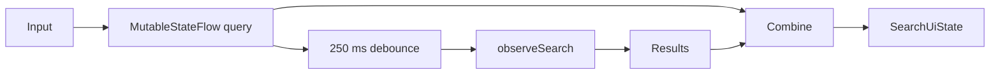

# Global Search

> **In plain words** — one box that searches names, ages, phone numbers, diagnoses, mechanism, and notes at once. Two techniques are worth learning here. **Debouncing**: the app waits 250 ms after you stop typing before querying, so typing "fracture" runs one search instead of eight. **Switching**: `flatMapLatest` abandons the previous search the moment a newer one starts, so results can never arrive out of order. The matching itself is one SQL query with several `LIKE` conditions and sub-queries. See [[Learn/Coroutines And Flow|Coroutines And Flow]] and [[Learn/Databases And Room|Databases And Room]].

## Purpose

Find active patient cases from one query across patient names, ages, phones, diagnoses, mechanisms, and notes.

## User Flow

The user opens search from the dashboard or widget, types a query, reviews matching case cards, and taps a result to open [[Features/Case Detail and Sharing|Case Detail and Sharing]].

## Execution Flow

`SearchViewModel` updates the visible query immediately, waits 250 ms, ignores duplicate queries, and uses `flatMapLatest` to switch the repository search flow. `SearchScreen` converts HTML notes to plain text for compact result previews.

## Important Classes

- `SearchScreen` and its `SearchResultCard`.
- `SearchViewModel` and `SearchUiState`.
- `SearchResult` — case-centric projection returned by the repository.

## Related ViewModels

- [[Components/ViewModels/SearchViewModel|SearchViewModel]]

## Related Repositories

- [[Components/Repositories/SearchRepository|SearchRepository]]

## API Calls

There is no remote API. The only data call is `SearchRepository.observeSearch(query)`, backed by local database queries and filtering.

## State Flow

The state has no loading or error field. Until the debounced repository flow switches, results from the preceding query can remain visible briefly under the new query text.

## Navigation

- Entry: dashboard search action or [[Features/Quick Capture Widget|Quick Capture Widget]].
- Back: pop the current route.
- Result: `case_detail/{caseId}`.

## Design Decisions

- Search is case-centric: one patient with multiple matching cases produces multiple results.
- Input receives focus on entry.
- Result previews show at most four diagnosis chips and two detail lines.
- Blank queries render guidance instead of querying meaningful content.

## Related Pages

- [[Features/Dashboard|Dashboard]]
- [[Features/Quick Capture Widget|Quick Capture Widget]]
- [[Features/Case Detail and Sharing|Case Detail and Sharing]]
- [[Execution Flows/Data Loading]]

## Source references

- `features/src/main/java/com/taha/kairos/features/search/SearchScreen.kt`
- `features/src/main/java/com/taha/kairos/features/search/SearchViewModel.kt`
- `core/src/main/java/com/taha/kairos/core/repository/SearchRepository.kt`
- `data/src/main/java/com/taha/kairos/data/repository/SearchRepositoryImpl.kt`
- `app/src/main/java/com/taha/kairos/navigation/KairosNavHost.kt`
