# Media Capture and Playback

> **In plain words** — photos, videos, voice recordings, and documents attached to a case. The rule that governs all of it: the **bytes live in files**, in a private folder only this app can read, while the **database stores only a relative path** plus type, duration, and whether it is the primary image. Relative, so a backup restored on a different phone still finds everything; the repository converts to a full path only when the UI needs to load it. Camera and microphone also require asking the user's permission at the moment of use, not just declaring it in the manifest. See [[Learn/Data Storage Choices|Data Storage Choices]] and [[Learn/Android App Basics|Android App Basics]].

## Purpose

Attach managed photos, videos, audio recordings, and arbitrary documents to cases; then preview, play, open, delete, share, or copy visual media to the system gallery.

## User Flow

- In capture/edit: take a photo or video, choose multiple gallery items or documents, record audio, select a primary visual, or remove an attachment.
- In detail: open visual media, play/delete audio, open/delete files, or share the case archive.
- In the viewer: swipe between visual items, zoom/pan images, play video, or save the current item to the gallery.

## Execution Flow

Imports and camera results are copied to managed temporary files. `PatientCaseViewModel` stages them as `PendingMedia`; Save creates final case-scoped files and atomically applies media rows/removals/primary selection. Repositories resolve stored relative paths to absolute paths for UI consumers.

```mermaid
flowchart LR
    Source["Camera, picker, recorder"] --> Temp["Managed temporary file"]
    Temp --> Pending["PendingMedia state"]
    Pending --> Save["Copy to final case file"]
    Save --> Rows["applyCaseEdits transaction"]
    Rows --> Detail["Case detail"]
    Detail --> Viewer["Image/video viewer"]
    Viewer --> Gallery["MediaStore copy"]
```

## Important Classes

- `NewPatientTab` and `PatientCaseViewModel` — capture/import and staging.
- `MediaFileManager` and `AudioRecorderEngine` — managed paths, FileProvider URIs, and recording.
- `MediaAttachmentSection`, `AudioRecorderModal`, and `AudioPlayerItem` — shared UI.
- `CaseDetailScreen` and `ImageViewerScreen` — playback and file opening.
- `ExoPlayer`, Coil `AsyncImage`, and `MediaStore` — platform/library integrations.

## Related ViewModels

- [[Components/ViewModels/PatientCaseViewModel|PatientCaseViewModel]]
- [[Components/ViewModels/CaseDetailViewModel|CaseDetailViewModel]]

## Related Repositories

- [[Components/Repositories/MediaRepository|MediaRepository]]
- [[Components/Repositories/CaseRepository|CaseRepository]]
- [[Components/Repositories/DataSafetyCoordinator|DataSafetyCoordinator]]

## API Calls

- Android permissions: `CAMERA`, `RECORD_AUDIO`, and legacy `WRITE_EXTERNAL_STORAGE` through API 28.
- Activity result contracts: `TakePicture`, `CaptureVideo`, `PickMultipleVisualMedia`, and `OpenMultipleDocuments`.
- Android content APIs: `ContentResolver`, FileProvider, `ACTION_VIEW`, and `MediaStore` insert/update/delete.
- Playback/rendering: Media3 `ExoPlayer`/`PlayerView` and Coil `AsyncImage`.
- Local persistence: `MediaRepository.applyCaseEdits`, `delete`, and `setPrimary`. No remote API is involved.

## State Flow

Recorder duration updates every 500 ms. Media import sets `isImportingMedia` to block saving until all content copies finish. The viewer derives its visual list from the case Flow owned by `CaseDetailViewModel`; it keeps pager/zoom/player state in Compose.

## Navigation

Visual thumbnails in `case_detail/{caseId}` open `image_viewer/{caseId}?index={index}`. The viewer reuses `CaseDetailViewModel` with the route's `caseId` and pops back to detail.

## Design Decisions

- The database stores relative media paths; case repository reads resolve them under the private media root.
- Imported original names/extensions are preserved where possible, while final storage names are app-controlled.
- Temporary sources remain until a complete save succeeds, enabling retry. `onCleared` cleans unsaved files.
- Viewer images support 1×–5× zoom and yield horizontal gestures to the pager at pan bounds.
- Video paging uses a custom swipe above the lower controller region; players pause off-page/on lifecycle pause and release on disposal.
- Android 10+ gallery writes use scoped storage and `IS_PENDING`; older versions request write permission. Failed inserts are removed.
- Import failures are skipped silently, and granting audio permission requires another tap to open recording.

## Related Pages

- [[Features/Patient and Case Capture|Patient and Case Capture]]
- [[Features/Case Detail and Sharing|Case Detail and Sharing]]
- [[Layers/Local Storage]]
- [[Architecture/Error Handling]]

## Source references

- `features/src/main/java/com/taha/kairos/features/patient/NewPatientTab.kt`
- `features/src/main/java/com/taha/kairos/features/patient/PatientCaseViewModel.kt`
- `features/src/main/java/com/taha/kairos/features/cases/CaseDetailScreen.kt`
- `features/src/main/java/com/taha/kairos/features/cases/ImageViewerScreen.kt`
- `core/src/main/java/com/taha/kairos/core/media/MediaFileManager.kt`
- `core/src/main/java/com/taha/kairos/core/media/AudioRecorderEngine.kt`
- `core/src/main/java/com/taha/kairos/core/components/MediaAttachmentSection.kt`
- `core/src/main/java/com/taha/kairos/core/components/AudioPlayerItem.kt`
- `app/src/main/AndroidManifest.xml`
