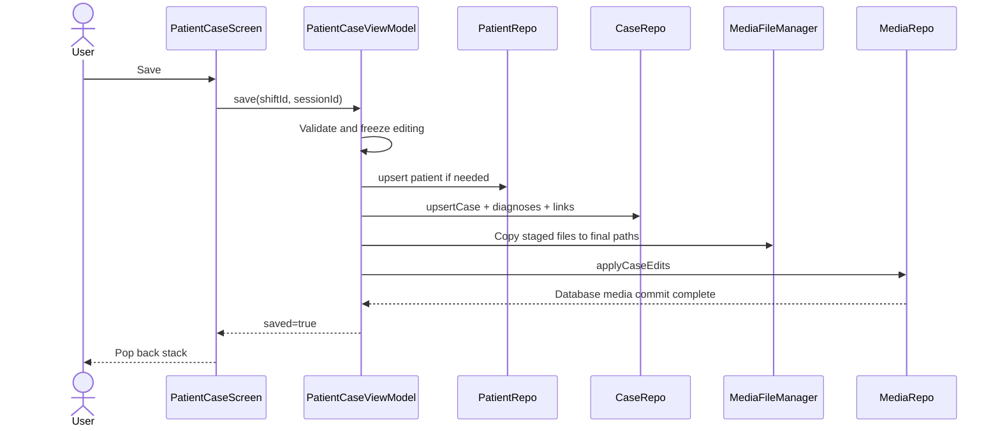

# Patient and Case Capture

> **In plain words** — the main data-entry form, and the most complicated screen in the app. One save has to write a patient, their phone numbers, the case, its diagnoses (creating any that do not exist yet), its attachments, and possibly a link to a shift or consultation session. All of that must succeed together or not at all, so the write runs inside database **transactions** and behind a global **data lock** that keeps a backup from capturing a half-written case. It is also the screen where the ViewModel holds *staged* edits — what you have typed but not yet saved — which is why its state is mutable while most other screens' state is not. See [[Learn/Databases And Room|Databases And Room]].

## Purpose

Create or edit the patient/case aggregate, including phones, diagnoses, rich notes, attachments, and optional shift or consultation links.

## User Flow

1. Enter from Cases, a shift, a consultation session, case edit, or the widget.
2. For a new case, create a patient or search and select an existing patient.
3. Enter the case date, mechanism, diagnoses, notes, and attachments.
4. Stop any active recording and save.
5. On success, return to the screen that initiated capture.

Editing loads the existing case and permits editing both patient and case fields. Selecting an existing patient for a new case locks the patient fields and collapses the two-tab picker into one form.

## Execution Flow

The save runs on `Dispatchers.IO + NonCancellable` under `DataSafetyCoordinator.withDataLock`. Successful patient/case IDs are retained for safe retry if a later media step fails.

## Important Classes

- `PatientCaseScreen`, `NewPatientTab`, and `ExistingPatientTab`.
- `PatientCaseViewModel`, `PatientCaseUiState`, `PendingMedia`, and `ExistingMedia`.
- Shared `PhoneInputSection`, `DiagnosisAutocomplete`, `RichNotesEditor`, and `MediaAttachmentSection`.
- `MediaFileManager` and `AudioRecorderEngine`.

## Related ViewModels

- [[Components/ViewModels/PatientCaseViewModel|PatientCaseViewModel]]
- [[Components/ViewModels/ShiftDetailViewModel|ShiftDetailViewModel]]
- [[Components/ViewModels/ConsultationViewModel|ConsultationViewModel]]
- [[Components/ViewModels/CaseDetailViewModel|CaseDetailViewModel]]

## Related Repositories

- [[Components/Repositories/PatientRepository|PatientRepository]]
- [[Components/Repositories/CaseRepository|CaseRepository]]
- [[Components/Repositories/DiagnosisRepository|DiagnosisRepository]]
- [[Components/Repositories/MediaRepository|MediaRepository]]
- [[Components/Repositories/DataSafetyCoordinator|DataSafetyCoordinator]]

## API Calls

- Patient lookup/save: `search`, `upsert`.
- Case load/save: `getById`, `upsertCase`.
- Diagnosis autocomplete: `searchByPrefix`.
- Media commit: `applyCaseEdits`.
- Android capture/import contracts and permissions are detailed in [[Features/Media Capture and Playback|Media Capture and Playback]]. There is no network API.

## State Flow

`PatientCaseUiState` is a single `MutableStateFlow` containing form values, patient search, diagnosis suggestions, existing and pending media, recorder state, load/import/save gates, completion, and error. `PatientCaseScreen` collects it lifecycle-aware and consumes `saved` and `error` through effects.

## Navigation

Route: `patient_case?shiftId={shiftId}&sessionId={sessionId}&caseId={caseId}`. Optional IDs select one of three behaviors: link on save to a shift, link on save to a consultation session, or load/edit an existing case. All missing optional values are represented by `-1` in navigation and converted to `null` before the screen.

## Design Decisions

- The patient and case are persisted before media rows; retained IDs make a media failure retry the same aggregate rather than duplicate it.
- Existing media deletion is staged until Save; pending media deletion removes the temporary file immediately.
- Exactly one visual attachment is selected as primary when visual media exists. Audio and generic files cannot be primary.
- Back navigation and pointer input are blocked during load, media import, and the non-cancellable save commit.
- Editing a case also updates the shared patient record, affecting its presentation in other cases.
- Existing-patient search is not debounced. Diagnosis autocomplete launches are not cancelled, so a slower older query can replace newer suggestions.
- `clearSelectedPatient()` exists but the screen currently exposes no way to return to the patient picker after selection.

## Related Pages

- [[Features/Media Capture and Playback|Media Capture and Playback]]
- [[Features/Shift Management|Shift Management]]
- [[Features/Consultation Calendar|Consultation Calendar]]
- [[Execution Flows/State Updates]]
- [[Execution Flows/Database Operations]]

## Source references

- `features/src/main/java/com/taha/kairos/features/patient/PatientCaseScreen.kt`
- `features/src/main/java/com/taha/kairos/features/patient/PatientCaseViewModel.kt`
- `features/src/main/java/com/taha/kairos/features/patient/NewPatientTab.kt`
- `features/src/main/java/com/taha/kairos/features/patient/ExistingPatientTab.kt`
- `core/src/main/java/com/taha/kairos/core/repository/PatientRepository.kt`
- `core/src/main/java/com/taha/kairos/core/repository/CaseRepository.kt`
- `core/src/main/java/com/taha/kairos/core/repository/MediaRepository.kt`
- `app/src/main/java/com/taha/kairos/navigation/KairosNavHost.kt`
