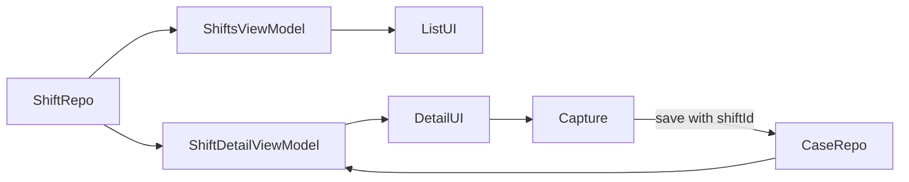

# Shift Management

> **In plain words** — a shift is a labelled working day that cases can be grouped under. The key design point is that a shift **links** to cases rather than owning them: the case is the real clinical record, and unlinking it from a shift does not delete it. In the database this is a *junction table* (`shift_cases`), where each row is simply a link between one shift and one case — the standard way to express "many-to-many". Deleting a shift is a soft delete with an undo, for the same reason as everywhere else in the app. See [[Learn/Databases And Room|Databases And Room]].

## Purpose

Group cases by work shift while keeping the patient case as the authoritative clinical record.

## User Flow

1. Open Shifts and create a dated shift with an optional label.
2. The new shift opens immediately.
3. Add a patient/case, which is linked to the shift when saved.
4. Open a linked case, long-press it to unlink, or delete the shift.
5. A list-level long-press soft-deletes a shift and offers one snackbar undo.

## Execution Flow

`ShiftsViewModel` observes active shifts and owns the add-dialog and undo state. `ShiftDetailViewModel` independently observes the selected shift and its linked cases. Patient capture receives `shiftId`; `CaseRepository.upsertCase(..., linkShiftId)` creates the link.

## Important Classes

- `ShiftsListScreen`, `ShiftDetailScreen`, and `AddShiftDialog`.
- `ShiftsViewModel` and `ShiftDetailViewModel`.
- `Shift`, `ShiftRepository`, and the case/shift cross-reference.

## Related ViewModels

- [[Components/ViewModels/ShiftsViewModel|ShiftsViewModel]]
- [[Components/ViewModels/ShiftDetailViewModel|ShiftDetailViewModel]]
- [[Components/ViewModels/PatientCaseViewModel|PatientCaseViewModel]]

## Related Repositories

- [[Components/Repositories/ShiftRepository|ShiftRepository]]
- [[Components/Repositories/CaseRepository|CaseRepository]]

## API Calls

Local calls are `observeAll()`, `upsert(shift)`, `softDelete(id)`, `restore(id)`, `observeById(shiftId)`, `observeByShift(shiftId)`, `unlinkFromShift(caseId, shiftId)`, and linked `upsertCase(...)`. No network API is involved.

## State Flow

Both ViewModels use `MutableStateFlow`; repository collectors update it from `viewModelScope`.

## Navigation

- `shifts` → `shift_detail/{shiftId}`.
- Shift detail add action → `patient_case?shiftId={shiftId}`.
- Linked case → `case_detail/{caseId}`.
- Save returns to the prior shift detail screen.

## Design Decisions

- Deleting a shift is a soft delete; list deletion offers undo and [[Features/Trash and Retention|Trash and Retention]] offers later restore.
- Long-pressing a case in detail removes only the association, not the case.
- Shift deletion and unlinking have no confirmation or error state.
- `ShiftsListScreen.onAddPatient` is currently unused; entry is intentionally through shift detail.
- Material date-picker values are UTC-midnight milliseconds but displays use the local time zone, which can shift the shown date in some zones.

## Related Pages

- [[Features/Patient and Case Capture|Patient and Case Capture]]
- [[Features/Trash and Retention|Trash and Retention]]
- [[Architecture/Data Flow]]
- [[Execution Flows/Navigation Flow]]

## Source references

- `features/src/main/java/com/taha/kairos/features/shifts/ShiftsListScreen.kt`
- `features/src/main/java/com/taha/kairos/features/shifts/ShiftsViewModel.kt`
- `features/src/main/java/com/taha/kairos/features/shifts/ShiftDetailScreen.kt`
- `features/src/main/java/com/taha/kairos/features/shifts/ShiftDetailViewModel.kt`
- `features/src/main/java/com/taha/kairos/features/shifts/AddShiftDialog.kt`
- `core/src/main/java/com/taha/kairos/core/repository/ShiftRepository.kt`
- `core/src/main/java/com/taha/kairos/core/repository/CaseRepository.kt`
