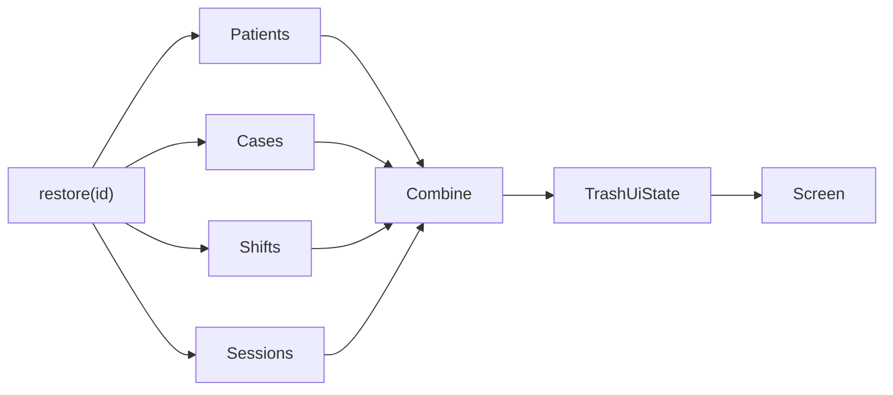

# Trash and Retention

> **In plain words** — deleting in Kairos does not delete. It sets a hidden flag and a timestamp, the record disappears from every normal list, and the trash screen shows it with roughly how long remains. A background job permanently removes anything older than 30 days, then cleans up diagnoses left with no cases and media files no longer referenced. The order matters: database rows are removed **before** their files, so an interruption can leave an orphaned file (harmless, cleaned later) but never a record pointing at a file that is gone. See [[Learn/Databases And Room|Databases And Room]] (soft delete) and [[Architecture/Background Work|Background Work]].

## Purpose

Allow recovery of soft-deleted patients, cases, shifts, and consultation sessions before automated permanent purge.

## User Flow

The user opens Trash from Settings, reviews records grouped by type and their approximate remaining retention, restores individual items, or waits for automatic purge.

## Execution Flow

`TrashViewModel` combines four repository trash flows. Restore dispatches to the owning repository and the reactive list removes the restored record. Separately, `TrashPurgeWorker` periodically hard-deletes records older than 30 days, removes orphan diagnoses, and deletes collected media files after database cleanup.

## Important Classes

- `TrashScreen`, `TrashViewModel`, `TrashUiState`, and `TrashRow`.
- `TrashPurgeWorker` and `WorkerScheduler`.
- Patient, case, shift, and consultation repositories/DAOs.

## Related ViewModels

- [[Components/ViewModels/TrashViewModel|TrashViewModel]]
- [[Components/ViewModels/SettingsViewModel|SettingsViewModel]]
- [[Components/ViewModels/ShiftsViewModel|ShiftsViewModel]]
- [[Components/ViewModels/CaseDetailViewModel|CaseDetailViewModel]]

## Related Repositories

- [[Components/Repositories/PatientRepository|PatientRepository]]
- [[Components/Repositories/CaseRepository|CaseRepository]]
- [[Components/Repositories/ShiftRepository|ShiftRepository]]
- [[Components/Repositories/ConsultationRepository|ConsultationRepository]]

## API Calls

Local calls are each repository's `observeTrashed()` and `restore(id)`. Permanent cleanup uses DAO hard-delete methods and `MediaFileManager`; WorkManager schedules it. No network API is involved.

## State Flow

The combined state uses `SharingStarted.WhileSubscribed(5_000)` and starts in a loading state.

## Navigation

`settings` → `trash`; back pops to Settings. Trash rows are not navigable to detail.

## Design Decisions

- User-facing deletion is generally soft deletion with a timestamp.
- The screen provides restore only, despite Settings describing “Restore or permanently delete items.” There is no manual hard-delete action.
- The remaining-day calculation floors partial days, so a newly deleted item can display 29 rather than 30 days.
- Restore failures are not shown in state.
- Consultation session restore is supported, although no current feature screen soft-deletes a session.
- Background purge fails closed when cached device authorization is unavailable and performs no mutation.

## Related Pages

- [[Features/Settings and Backup|Settings and Backup]]
- [[Architecture/Background Work]]
- [[Execution Flows/Background Jobs]]
- [[Execution Flows/Database Operations]]

## Source references

- `features/src/main/java/com/taha/kairos/features/settings/TrashScreen.kt`
- `features/src/main/java/com/taha/kairos/features/settings/TrashViewModel.kt`
- `data/src/main/java/com/taha/kairos/data/backup/TrashPurgeWorker.kt`
- `data/src/main/java/com/taha/kairos/data/backup/WorkerScheduler.kt`
- `data/src/main/java/com/taha/kairos/data/authorization/CachedAuthorizationGuard.kt`
- `core/src/main/java/com/taha/kairos/core/repository/PatientRepository.kt`
- `core/src/main/java/com/taha/kairos/core/repository/CaseRepository.kt`
