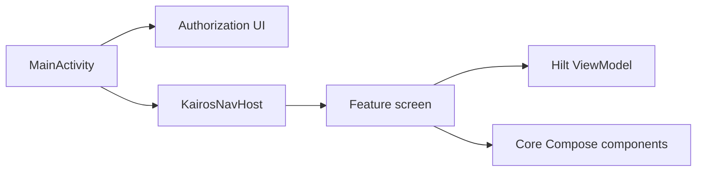

# UI Layer

> **In plain words** — everything the user actually sees. Written in **Jetpack Compose**, where a screen is a function that describes what should be on screen for the current state, and the toolkit works out what to redraw. Kairos keeps its screens deliberately stupid: they receive state, draw it, and report taps through callbacks. They do not fetch data, do not decide where to navigate, and do not hold the truth. That is why the same screen can be previewed in the design tool, tested without a database, and reused from more than one place. See [[Learn/Jetpack Compose Basics|Jetpack Compose Basics]].

## Role

The UI is Jetpack Compose. `:app` owns the activity shell, authorization gate, bottom navigation, and `NavHost`; `:features` owns feature screens; `:core` exposes reusable themed components.

## Boundaries

- Screens render immutable UI state collected with lifecycle awareness and send user events to a Hilt ViewModel.
- Navigation callbacks are passed into screens; feature code does not own a `NavController`.
- Activity Result APIs handle camera, documents, folders, and sharing at the composable boundary.
- Reusable widgets such as cards, media controls, notes, and diagnosis autocomplete live in `core/components`.

## State and events

Most screens use `collectAsStateWithLifecycle`; temporary picker/dialog state may use Compose `remember`/`rememberSaveable`. Business state belongs in [[Layers/ViewModels|ViewModels]]. Cross-screen transitions are described in [[Architecture/Navigation|Navigation]].

## Design constraints

- The protected app UI is not composed until [[Features/Device Authorization|Device Authorization]] grants access.
- The bottom bar appears only on top-level routes.
- Feature screens should remain previewable by receiving callbacks instead of navigating directly.

## Related pages

- [[Architecture/State Management|State Management]]
- [[Components/UI/Reusable UI Components|Reusable UI Components]]
- [[Diagrams/Navigation Graph|Navigation Graph]]

## Source references

- `app/src/main/java/com/taha/kairos/MainActivity.kt`
- `app/src/main/java/com/taha/kairos/navigation/KairosNavHost.kt`
- `app/src/main/java/com/taha/kairos/ui/BottomBar.kt`
- `features/src/main/java/com/taha/kairos/features/patient/PatientCaseScreen.kt`
- `core/src/main/java/com/taha/kairos/core/components/CaseCard.kt`
