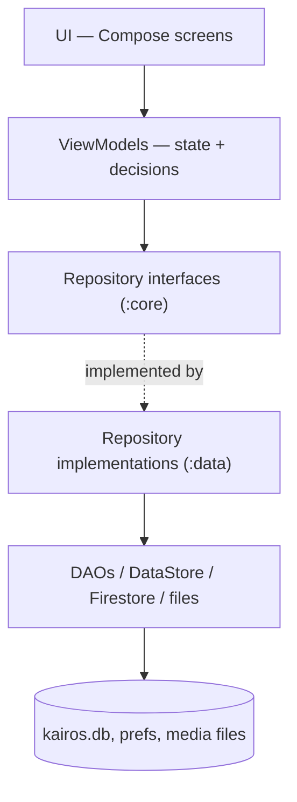
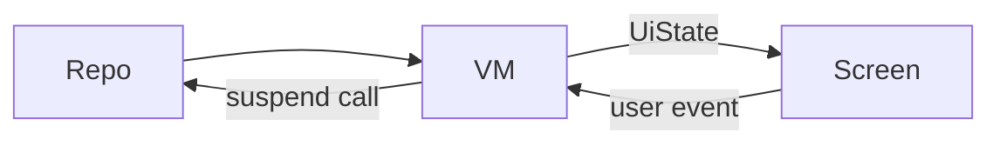

# Architecture Patterns

Why Kairos's code is split the way it is. This page answers the question "why are there five files involved in showing one list?".

## The problem architecture solves

A small app can put everything in one file. At ~150 files, that stops working: nobody can tell what a change will break, two pieces disagree about the truth, and testing anything requires a phone with a real database.

Architecture is a set of rules about **who may talk to whom**. The rules cost some extra files. They buy the ability to change one thing without fear.

## Layers

Kairos is layered. Each layer knows only about the layer beneath it.



| Layer | Job | Never does |
|---|---|---|
| **UI** | draw state, report user events | decide business rules, touch the database |
| **ViewModel** | hold screen state, react to events, orchestrate repositories | draw anything, know about Room |
| **Repository** | own a slice of data, hide where it comes from | know about screens |
| **DAO / store** | execute one persistence operation | contain business rules |

The compiler enforces the important boundary: `:features` does not depend on `:data`, so a screen literally cannot call a DAO. See [[Learn/Gradle And Modules|Gradle And Modules]].

## MVVM

**Model – View – ViewModel**, the pattern the middle of that stack implements.

- **Model** — the data and the rules about it (`Case`, `Patient`, repositories).
- **View** — the Compose screen. Dumb on purpose: it renders what it is given.
- **ViewModel** — the piece between them. It survives screen rotation, holds the current UI state, and turns user events into repository calls.

The distinctive property of a ViewModel is that it **outlives the screen**. Rotate the phone: Android destroys and rebuilds the Activity's UI, but hands the same ViewModel back, so the loaded list and half-typed form are still there.

```kotlin
@HiltViewModel
class CaseFeedViewModel @Inject constructor(
    savedStateHandle: SavedStateHandle,
    caseRepo: CaseRepository,
) : ViewModel() {
    val ui: StateFlow<CaseFeedUiState> = ...
}
```

Note what it depends on: a `CaseRepository` **interface** and a `SavedStateHandle` (the navigation arguments). It knows nothing about Room, SQL, or files.

## Unidirectional data flow

State goes one way down; events go one way up. Never both directions in one channel.



Concretely, on the trash screen: the user taps restore → the screen calls `viewModel.restore(id)` → the ViewModel calls `repository.restore(id)` → the repository updates the row → Room notices the table changed → the observing `Flow` emits a new list → the ViewModel maps it into new state → Compose redraws.

The screen never mutates the list itself. There is exactly one source of truth, and it is the database. This is why Kairos screens rarely have refresh bugs.

## UI state as a single object

Each screen has one data class describing everything it needs:

```kotlin
data class CaseFeedUiState(
    val cases: List<Case> = emptyList(),
    val diagnosisName: String = "",
    val isLoading: Boolean = true,
)
```

One object, replaced wholesale on every change. The alternative — separate `cases`, `loading`, and `error` variables — allows impossible combinations like "loading *and* showing an error *and* holding stale data". Bundling them makes the screen's possible states explicit and few.

## Why an interface plus an implementation

`:core` declares:

```kotlin
interface CaseRepository {
    suspend fun getById(id: Long): Case?
}
```

`:data` implements it as `CaseRepositoryImpl`. The ViewModel is handed the interface and never learns which implementation it got. Three payoffs:

1. **Testability.** A test can supply a fake repository returning canned cases — no phone, no database, instant.
2. **Replaceability.** Swap SQLite for something else and only `:data` changes.
3. **Comprehension.** The interface is a one-screen summary of everything that can be done with cases. Read `CaseRepository.kt` and you know the vocabulary without reading 300 lines of implementation.

This is called *programming to an interface*, and it is why the wiki's component pages so often say "interface in `:core`, implementation in `:data`".

## Domain model vs database entity

Two classes describe a case:

| `Case` (`:core`) | `CaseEntity` (`:data`) |
|---|---|
| what the app means by a case | what one row of the `cases` table looks like |
| holds a real `Patient`, a `List<Diagnosis>`, a `List<MediaItem>` | holds `patientId`, plus sync bookkeeping columns |
| known to screens | never leaves `:data` |

Duplication? No — they change for different reasons. Adding an index or a `sync_state` column is a storage concern that should not ripple into every screen. The translation between them is done by a [[Layers/Mappers|mapper]], and is deliberately the only place that knows both shapes.

## Where the rules live

Kairos has **no separate use-case/interactor layer**; ViewModels call repositories directly. That is a legitimate choice for an app of this size — a use-case layer that only forwards calls is pure ceremony. The consequence is that ViewModels carry the orchestration (e.g. "save the patient, then the case, then the media"), so they are the place to look for feature logic. See [[Components/Use Cases|Use Cases]].

## Related pages

- [[Overview/Architecture|Architecture]]
- [[Architecture/Data Flow|Data Flow]]
- [[Layers/Layers Index|Layers]]
- [[Learn/Design Patterns Glossary|Design Patterns Glossary]]
- [[Learn/Code Tour One Feature|Code Tour One Feature]]
