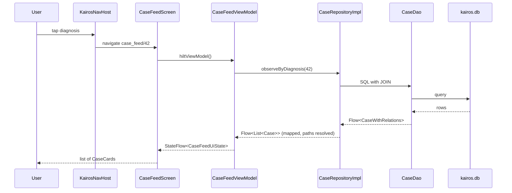

# Code Tour One Feature

One tap, traced through every file it touches. Read this after [[Learn/Kotlin Basics|Kotlin Basics]] and you will understand the whole architecture from one concrete example.

**The action:** the user is on the Cases tab, taps a diagnosis such as "Femur fracture", and sees every case tagged with it.

## The cast

| Step | File | Module |
|---|---|---|
| 1 | `KairosNavHost.kt` | `:app` |
| 2 | `CaseFeedScreen.kt` | `:features` |
| 3 | `CaseFeedViewModel.kt` | `:features` |
| 4 | `CaseRepository.kt` (interface) | `:core` |
| 5 | `CaseRepositoryImpl.kt` | `:data` |
| 6 | `CaseDao.kt` | `:data` |
| 7 | `CaseMapper.kt` | `:data` |
| 8 | `Case.kt` (domain model) | `:core` |

Eight files for one list. By the end of this page each one will have an obvious reason to exist.

## Step 1 — navigation

The Cases tab shows `DiagnosisBrowseScreen`. Tapping a diagnosis calls a callback the screen was given:

```kotlin
DiagnosisBrowseScreen(
    onNavigateToCaseFeed = { id, name ->
        navController.navigate("case_feed/$id?name=${Uri.encode(name)}")
    },
    ...
)
```

The screen does not navigate. It reports "the user chose diagnosis 42, named Femur fracture", and `KairosNavHost` — the only place that knows the app's map — turns that into a **route**, a text address like `case_feed/42?name=Femur%20fracture`. `Uri.encode` escapes characters that would break the address.

The matching destination declares what the route contains:

```kotlin
composable(
    route = "case_feed/{diagnosisId}?name={diagnosisName}",
    arguments = listOf(
        navArgument("diagnosisId") { type = NavType.LongType },
        navArgument("diagnosisName") { defaultValue = "" },
    ),
) {
    CaseFeedScreen(
        onNavigateBack = { navController.popBackStack() },
        onCaseClick = { caseId -> navController.navigate("case_detail/$caseId") },
    )
}
```

`{diagnosisId}` is required and must be a number. `?name=` is optional with a default. Note that `CaseFeedScreen` is not handed the id — the navigation library stores the arguments, and the ViewModel will pick them up.

## Step 2 — the screen

```kotlin
@Composable
fun CaseFeedScreen(
    onNavigateBack: () -> Unit,
    onCaseClick: (caseId: Long) -> Unit,
    viewModel: CaseFeedViewModel = hiltViewModel(),
) {
    val state by viewModel.ui.collectAsStateWithLifecycle()
```

`hiltViewModel()` asks Hilt for a `CaseFeedViewModel`, fully constructed. `collectAsStateWithLifecycle()` subscribes to its state stream; whenever new state arrives this function re-runs and the screen updates.

Then it renders exactly what the state says:

```kotlin
if (!state.isLoading && state.cases.isEmpty()) {
    EmptyState(title = "No cases", message = "No cases tagged with ${state.diagnosisName}")
} else {
    LazyColumn { items(state.cases, key = { it.id }) { case ->
        CaseCard(case = case, onClick = { onCaseClick(case.id) })
    } }
}
```

Three states — loading, empty, populated — from one object. The `!state.isLoading` guard is what stops the empty message flashing before data arrives. Tapping a card calls `onCaseClick`, which travels back up to `KairosNavHost`. The screen still knows nothing about where it leads.

## Step 3 — the ViewModel

```kotlin
@HiltViewModel
class CaseFeedViewModel @Inject constructor(
    savedStateHandle: SavedStateHandle,
    caseRepo: CaseRepository,
) : ViewModel() {

    private val diagnosisId: Long = savedStateHandle.get<Long>("diagnosisId") ?: -1L
    private val diagnosisName: String = savedStateHandle["diagnosisName"] ?: ""

    val ui: StateFlow<CaseFeedUiState> = if (diagnosisId == -1L) {
        flowOf(CaseFeedUiState(isLoading = false))
    } else {
        caseRepo.observeByDiagnosis(diagnosisId)
            .map { cases -> CaseFeedUiState(cases = cases, diagnosisName = diagnosisName, isLoading = false) }
    }.stateIn(viewModelScope, SharingStarted.WhileSubscribed(5_000), CaseFeedUiState(diagnosisName = diagnosisName))
}
```

Line by line:

- `SavedStateHandle` is where the navigation arguments landed. This is how the route's `{diagnosisId}` reaches the code, without the screen passing it.
- `?: -1L` is a defensive default — if no id arrived, use −1, and the branch below shows an empty screen rather than crashing.
- `caseRepo.observeByDiagnosis(diagnosisId)` asks for a **live stream** of matching cases.
- `.map { ... }` converts each emitted list into the screen's state object, flipping `isLoading` to false.
- `.stateIn(...)` makes it a `StateFlow` with an immediate initial value (the diagnosis name is already known, so the title renders on frame one).

The ViewModel has no `loadCases()` function and no refresh logic. It describes a permanent relationship: *this screen's state is that database query, reshaped*. See [[Learn/Coroutines And Flow|Coroutines And Flow]].

## Step 4 — the contract

```kotlin
interface CaseRepository {
    fun observeByDiagnosis(diagnosisId: Long): Flow<List<Case>>
    ...
}
```

This lives in `:core`, which `:features` depends on. It is the entire vocabulary the ViewModel has — no SQL, no Room types. Because it is an interface, a test can hand the ViewModel a fake that emits three invented cases.

## Step 5 — the implementation

```kotlin
@Singleton
class CaseRepositoryImpl @Inject constructor(
    private val caseDao: CaseDao,
    private val diagnosisDao: DiagnosisDao,
    private val db: KairosDatabase,
    private val mediaFileManager: MediaFileManager,
    private val dataSafetyCoordinator: DataSafetyCoordinator,
) : CaseRepository {
```

The constructor is the full list of what this class may touch. Hilt supplies all five — see [[Learn/Dependency Injection Explained|Dependency Injection Explained]].

The relevant method chains three transformations onto the DAO's stream: map each database row-with-relations into a domain `Case`, then rewrite relative media paths into absolute ones so the UI can load them:

```kotlin
private fun Case.resolveMediaPaths(): Case = copy(
    media = media.map { m -> m.copy(filePath = mediaFileManager.resolve(m.filePath).absolutePath) }
)
```

That single detail is a real Kairos rule: **the database stores relative paths; the repository hands out absolute ones.** See [[Learn/Data Storage Choices|Data Storage Choices]].

## Step 6 — the query

```kotlin
@Transaction
@Query("""
    SELECT c.* FROM cases c
    INNER JOIN case_diagnoses cd ON cd.case_id = c.id
    WHERE cd.diagnosis_id = :diagnosisId AND c.is_deleted = 0
    ORDER BY c.case_date DESC
""")
fun observeByDiagnosis(diagnosisId: Long): Flow<List<CaseWithRelations>>
```

In English: *take the cases table, follow the case↔diagnosis link table, keep the rows linked to this diagnosis that are not in the trash, newest first.*

Three things worth pausing on:

- `is_deleted = 0` — the soft-delete rule, present in every list query.
- `Flow<...>` — Room will re-run this query whenever `cases` or `case_diagnoses` changes. That is the entire refresh mechanism of the app.
- `@Transaction` — `CaseWithRelations` requires extra queries for patient, diagnoses, and media; the transaction guarantees they all see one consistent snapshot.

## Step 7 — the mapper

```kotlin
fun CaseWithRelations.toDomain(): Case = Case(
    id = case.id,
    patientId = case.patientId,
    patient = patient?.toDomain(),
    caseDate = case.caseDate,
    diagnoses = diagnoses.map { it.toDomain() },
    media = media.map { it.toDomain() },
    ...
)
```

The translation point. Database shape in, domain shape out. Database-only columns (`sync_state`, `remote_id`, `is_deleted`) simply do not appear in `Case`, so they can never leak into a screen. See [[Layers/Mappers|Mappers]].

## Step 8 — what the screen finally holds

```kotlin
data class Case(
    val id: Long = 0,
    val patientId: Long,
    val patient: Patient? = null,
    val caseDate: Long,
    val mechanism: String? = null,
    val notesHtml: String? = null,
    val diagnoses: List<Diagnosis> = emptyList(),
    val media: List<MediaItem> = emptyList(),
    ...
)
```

Plain Kotlin. No Room, no Android, no annotations. `CaseCard` can render it, and a unit test can create one in a single line.

## The round trip



## Now watch it update itself

Delete one of those cases from elsewhere in the app. `softDelete` sets `is_deleted = 1`. Room notices the `cases` table changed, re-runs the query above, the row no longer matches, a shorter list flows up through the repository and ViewModel, and Compose removes exactly that one card.

Nobody wrote a single line of refresh code. That is what the eight files bought.

## The same trip in the other direction

Saving a case reverses the flow and adds transactional safety — `upsertCase` takes a global data lock, opens a Room transaction, inserts or updates the case row, clears and rewrites its diagnosis links (creating any diagnosis that does not exist yet), and optionally links the case to a shift or session. All of it succeeds or none of it does. See [[Components/Repositories/CaseRepository|CaseRepository]] and [[Learn/Databases And Room|Databases And Room]].

## Related pages

- [[Execution Flows/Data Loading|Data Loading]]
- [[Execution Flows/State Updates|State Updates]]
- [[Features/Diagnosis Browser|Diagnosis Browser]]
- [[Learn/Architecture Patterns|Architecture Patterns]]
- [[Learn/Reading The Codebase|Reading The Codebase]]
