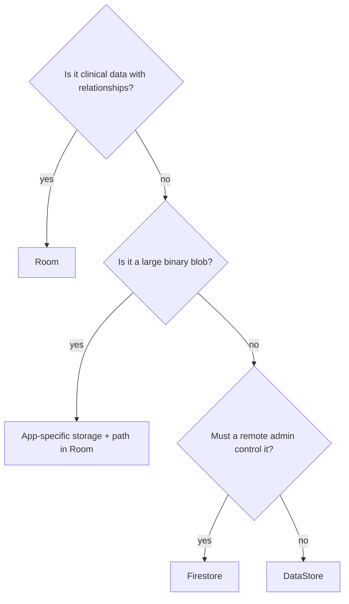

# Data Storage Choices

Kairos stores things in four different places. Each exists for a reason; using the wrong one is a real bug.

| Store | Holds | Why this one |
|---|---|---|
| **Room** (`kairos.db`) | patients, cases, diagnoses, shifts, sessions, media *metadata* | structured, related, queryable, must support search and statistics |
| **DataStore** (`kairos_prefs`) | user settings, backup schedule, authorization lease | a handful of simple key/value settings, no relationships |
| **Files** (app-specific storage) | the actual photos, videos, audio, attachments | binary blobs, potentially hundreds of megabytes |
| **Firestore** (cloud) | one document per authorized device ID | must be controlled remotely, by someone other than the phone's user |

## Room — the clinical record

Everything relational. See [[Learn/Databases And Room|Databases And Room]]. Rule of thumb: if you would ever want to filter it, sort it, count it, or join it to something else, it belongs in Room.

## DataStore — settings

**DataStore** is the modern replacement for `SharedPreferences`: an asynchronous key/value store that exposes its contents as a `Flow`.

```kotlin
private val Context.dataStore: DataStore<Preferences> by preferencesDataStore(name = "kairos_prefs")

private object Keys {
    val THEME_MODE = stringPreferencesKey("theme_mode")
    val BACKUP_SCHEDULE = stringPreferencesKey("backup_schedule")
    val BACKUP_LAST_RUN_AT = longPreferencesKey("backup_last_run_at")
}
```

Each key is typed. Reading maps the raw preferences into a typed `AppSettings` object, always supplying a default for a key that has never been written:

```kotlin
themeMode = prefs[Keys.THEME_MODE]?.let { v -> ThemeMode.entries.find { it.name == v } } ?: ThemeMode.SYSTEM
```

Read that as: *if a theme was saved and it matches a known option, use it; otherwise follow the system.* Enums are stored by name, which keeps the stored value readable and stable.

Because `settings` is a `Flow`, a settings change propagates by itself — `MainActivity` re-themes and `KairosApplication` re-schedules backups without anybody calling them. See [[Components/Databases/PreferencesStore|PreferencesStore]].

A second, separate DataStore holds the device authorization lease — see [[Components/Databases/Device Authorization DataStore|Device Authorization DataStore]].

## Files — the media

Photos and audio do not belong in a database. Kairos keeps the bytes in **app-specific storage** (a private folder only this app can read) and stores only a **relative path** in the `case_media` table.

Relative, not absolute, and this matters:

- The absolute path of app storage can change between installs, devices, and restores.
- A backup restored on a new phone would have every media reference broken if absolute paths were stored.

So the database says `media/2025/06/img_1234.jpg`, and `MediaFileManager.resolve` turns that into a full path at the moment it is needed. See [[Components/Managers/MediaFileManager|MediaFileManager]].

The consequence to remember: **paths coming out of the repository for display are absolute; paths stored in the database are relative.**

## Firestore — authorization only

Firestore is a Google cloud database. Kairos uses it for exactly one question: *is this device ID allowed to run this app?* No patient, case, diagnosis, note, or media ever goes near it.

The reason it is remote at all is that the answer must be changeable by someone who is not holding the phone — revoking a lost or reassigned device. Everything else stays local because clinical data leaving the device is the risk being designed against. See [[Features/Device Authorization|Device Authorization]] and [[Learn/Security And Privacy Basics|Security And Privacy Basics]].

## What "offline-first" costs and buys

**Buys:** works in a basement operating theatre with no signal; no server to breach; no per-user hosting cost; instant reads.

**Costs:** the phone is the only copy, so backup is not optional — it is a core feature. Hence a dedicated backup engine, a scheduled worker, generational retention, health warnings, and an export path that works *even when the app is locked*. See [[Features/Settings and Backup|Settings and Backup]].

## Choosing, in practice



## Related pages

- [[Layers/Local Storage|Local Storage]]
- [[Layers/Data Sources|Data Sources]]
- [[Components/Databases/Databases Index|Databases]]
- [[Learn/Databases And Room|Databases And Room]]
