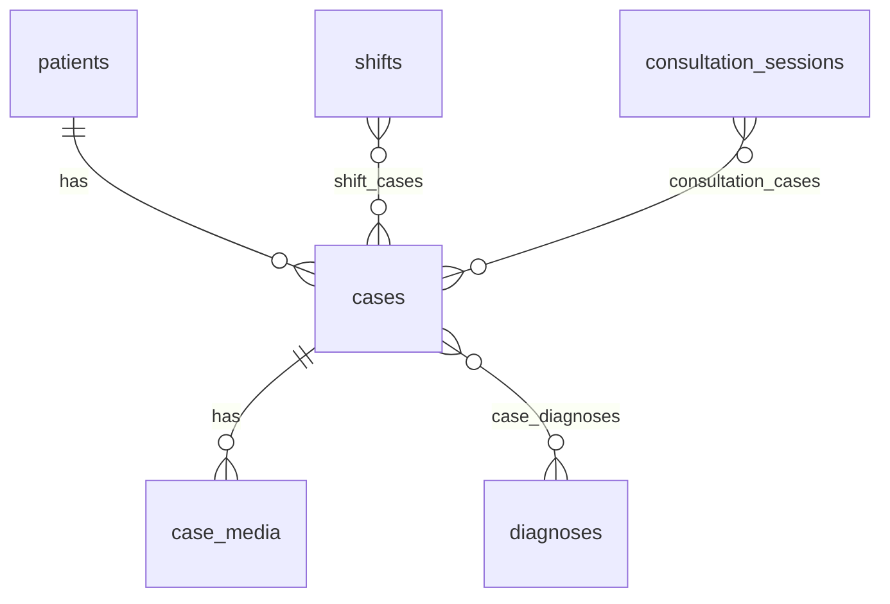

# Databases And Room

Where every patient, case, diagnosis, shift, and session actually lives. This is the most important page in the Learn section for understanding Kairos.

## What a database is

A **relational database** is a set of tables. A table is a grid: columns are fields, rows are records. Kairos's database is a single file on the phone named `kairos.db`, powered by **SQLite** — a complete database engine built into Android.

The `cases` table, conceptually:

| id | patient_id | case_date | mechanism | notes_html | is_deleted |
|---|---|---|---|---|---|
| 1 | 12 | 1750000000000 | Fall from height | `<p>...</p>` | 0 |
| 2 | 12 | 1750500000000 | RTA | `<p>...</p>` | 0 |

## Keys

- **Primary key** — the column that uniquely identifies a row. In Kairos every table has `id`, declared `@PrimaryKey(autoGenerate = true)`, so SQLite assigns the next free number automatically. This is why a new, unsaved `Case` has `id = 0`.
- **Foreign key** — a column holding another table's primary key, creating a link. `cases.patient_id` points at `patients.id`. The database itself refuses to store a case pointing at a patient that does not exist.

```kotlin
foreignKeys = [
    ForeignKey(
        entity = PatientEntity::class,
        parentColumns = ["id"],
        childColumns = ["patient_id"],
        onDelete = ForeignKey.CASCADE
    )
]
```

`onDelete = CASCADE` means: if that patient row is ever physically deleted, its cases go too. Referential integrity is enforced by the engine, not by hopeful application code.

## Indices

```kotlin
indices = [Index("patient_id"), Index("case_date"), Index("is_deleted")]
```

An **index** is a lookup structure that makes searching a column fast, at the cost of a little space and slightly slower writes. Kairos indexes exactly the columns it filters and sorts by: which patient, what date, and whether it is in the trash. Without them, every case list would scan the whole table.

## Relationships

**One-to-many** — one patient has many cases. Modelled by putting `patient_id` on the case.

**Many-to-many** — a case can have several diagnoses, and a diagnosis applies to many cases. You cannot express this with a single column, so you add a **junction table** (also called a cross-reference or join table):

```kotlin
@Entity(
    tableName = "case_diagnoses",
    primaryKeys = ["case_id", "diagnosis_id"],
    ...
)
data class CaseDiagnosisCrossRef(
    @ColumnInfo("case_id") val caseId: Long,
    @ColumnInfo("diagnosis_id") val diagnosisId: Long,
)
```

Each row is one link. The composite primary key `["case_id", "diagnosis_id"]` makes duplicate links impossible. Kairos uses this shape three times: `case_diagnoses`, `shift_cases`, and `consultation_cases`.



## SQL, briefly

**SQL** is the language for asking a database questions. The three shapes you need:

```sql
SELECT * FROM cases WHERE is_deleted = 1 ORDER BY deleted_at DESC
```
*Give me all columns of every trashed case, newest deletion first.*

```sql
UPDATE cases SET is_deleted = 1, deleted_at = :now WHERE id = :id
```
*Mark this one case as deleted.*

```sql
SELECT c.* FROM cases c
INNER JOIN case_diagnoses cd ON cd.case_id = c.id
WHERE cd.diagnosis_id = :diagnosisId AND c.is_deleted = 0
ORDER BY c.case_date DESC
```
*Give me the cases linked to this diagnosis, ignoring trashed ones, newest first.*

A **JOIN** stitches rows from two tables together using a matching column. `INNER JOIN` keeps only rows that have a match on both sides. `c` and `cd` are short aliases. `:diagnosisId` is a **parameter** — Room fills it from the function argument, which also makes SQL injection impossible.

All three of those queries are real, from `CaseDao`.

## Room: the bridge between Kotlin and SQLite

Writing raw SQLite calls by hand is verbose and error-prone. **Room** is a library that generates that code from three kinds of declaration.

### 1. Entity — a Kotlin class that is a table

```kotlin
@Entity(tableName = "cases", ...)
data class CaseEntity(
    @PrimaryKey(autoGenerate = true) val id: Long = 0,
    @ColumnInfo("patient_id") val patientId: Long,
    @ColumnInfo("case_date") val caseDate: Long,
    val mechanism: String? = null,
    @ColumnInfo("is_deleted") val isDeleted: Boolean = false,
    ...
)
```

`@ColumnInfo` maps Kotlin's `camelCase` to SQL's `snake_case`. A `String?` becomes a nullable column. A `Boolean` is stored as 0 or 1.

Note the suffix: `CaseEntity` is the *database* shape, distinct from `Case`, the *domain* shape used by screens. Why they are separate is explained in [[Learn/Architecture Patterns|Architecture Patterns]] and [[Layers/Mappers|Mappers]].

### 2. DAO — the questions you may ask

**DAO** stands for Data Access Object: an interface where each function is one database operation.

```kotlin
@Dao
interface CaseDao {
    @Insert(onConflict = OnConflictStrategy.ABORT)
    suspend fun insert(case: CaseEntity): Long

    @Query("SELECT * FROM cases WHERE id = :id")
    suspend fun getById(id: Long): CaseWithRelations?

    @Query("SELECT COUNT(*) FROM cases WHERE is_deleted = 0")
    fun observeTotalCases(): Flow<Int>
}
```

You write no bodies. Room's compiler generates `CaseDao_Impl` at build time and — crucially — **validates the SQL against your schema during the build**. Misspell a column and the build fails, not the app.

`onConflict` decides what happens when a row would collide with an existing one: `ABORT` fails loudly (used for real inserts), `IGNORE` silently skips (used for junction links, making "link this case to this shift" safely repeatable), `REPLACE` overwrites.

Returning `Flow<T>` instead of `T` turns a query into a live subscription — Room re-runs it whenever the queried tables change. That is the engine behind every self-updating list in Kairos. See [[Learn/Coroutines And Flow|Coroutines And Flow]].

### 3. Database — the container

```kotlin
@Database(
    entities = [PatientEntity::class, CaseEntity::class, ...],
    version = 2,
    exportSchema = true,
)
abstract class KairosDatabase : RoomDatabase() {
    abstract fun caseDao(): CaseDao
    ...
}
```

Ten entities, six DAOs, one file. It is created once, as a singleton, in `DatabaseModule`:

```kotlin
Room.databaseBuilder(context, KairosDatabase::class.java, "kairos.db")
    .addMigrations(*Migrations.ALL_MIGRATIONS)
    .build()
```

## Relation objects — one query, several tables

Loading a case usually means loading its patient, its diagnoses, and its media too. Room handles this with `@Relation`:

```kotlin
data class CaseWithRelations(
    @Embedded val case: CaseEntity,
    @Relation(parentColumn = "patient_id", entityColumn = "id", ...)
    val patient: PatientWithPhones?,
    @Relation(
        parentColumn = "id", entityColumn = "id",
        associateBy = Junction(CaseDiagnosisCrossRef::class, "case_id", "diagnosis_id"),
    )
    val diagnoses: List<DiagnosisEntity>,
    @Relation(parentColumn = "id", entityColumn = "case_id")
    val media: List<CaseMediaEntity>,
)
```

`@Embedded` flattens the case's own columns in; each `@Relation` tells Room to fetch the related rows and attach them. `Junction` is how it traverses a many-to-many link. DAO functions returning such a type are marked `@Transaction`, so all the sub-queries see one consistent snapshot.

## Transactions — all or nothing

A **transaction** groups several writes so that either all succeed or none do. Saving a case means writing the case row *and* replacing its diagnosis links; a crash in between would leave a case with the wrong diagnoses. So the repository wraps the whole sequence:

```kotlin
db.withTransaction {
    // insert or update the case
    // clear old diagnosis links
    // insert new diagnosis links
}
```

Same idea as a surgical checklist: partial completion is worse than not starting.

## Soft delete

Kairos does not delete records when you tap delete. It sets a flag:

```sql
UPDATE cases SET is_deleted = 1, deleted_at = :now, sync_state = 'DELETED', updated_at = :now WHERE id = :id
```

The row stays, invisible to normal queries (which all carry `WHERE is_deleted = 0`) and visible to the trash screen (`WHERE is_deleted = 1`). A background worker later **hard-deletes** rows whose `deleted_at` is older than the retention period. That is why deletion in Kairos is recoverable, and why every list query in the DAO carries that `is_deleted = 0` condition. See [[Features/Trash and Retention|Trash and Retention]].

## Migrations — changing the schema safely

The database on a user's phone already contains their data. If a new app version adds a column, Room must be told how to transform the existing file rather than wiping it.

```kotlin
val MIGRATION_1_2 = object : Migration(1, 2) {
    override fun migrate(db: SupportSQLiteDatabase) {
        db.execSQL("ALTER TABLE case_media ADD COLUMN original_file_name TEXT")
    }
}
```

That is Kairos's real and only migration so far: version 1 → 2 added the original file name of an attachment. The rules encoded in `Migrations.kt`:

1. Bump `version` in `KairosDatabase`.
2. Write a `Migration(X, Y)` with the SQL.
3. Add it to `ALL_MIGRATIONS`.
4. Never skip a version number.

Skipping a migration means the app either crashes on launch or destroys real patient data. `exportSchema = true` writes the schema to `data/schemas` so migrations can be tested against the exact previous version.

## Related pages

- [[Components/Databases/KairosDatabase|KairosDatabase]]
- [[Components/DAOs/DAOs Index|DAOs]]
- [[Diagrams/Database Relationships|Database Relationships]]
- [[Execution Flows/Database Operations|Database Operations]]
- [[Components/Utilities/Migrations|Migrations]]
