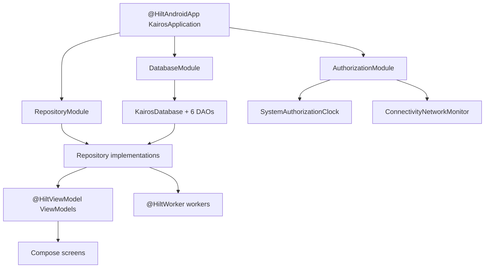

# Dependency Injection Explained

What all those `@Inject`, `@Module`, and `@Provides` annotations do, from zero.

## The problem

A ViewModel needs a repository. The repository needs DAOs. The DAOs come from the database. The database needs an Android `Context`. Written by hand, every screen would begin:

```kotlin
val db = Room.databaseBuilder(context, KairosDatabase::class.java, "kairos.db").build()
val repo = CaseRepositoryImpl(db.caseDao(), db.diagnosisDao(), db, mediaFileManager, ...)
val viewModel = CaseFeedViewModel(savedStateHandle, repo)
```

Three problems. It is repeated everywhere. Every screen would build its *own* database (catastrophic — one file, several connections, conflicting state). And nothing can be swapped out for a test.

## The idea

**Dependency injection** inverts the responsibility: a class *declares* what it needs and is *given* it. It never constructs its own dependencies.

```kotlin
class CaseFeedViewModel @Inject constructor(
    savedStateHandle: SavedStateHandle,
    caseRepo: CaseRepository,
) : ViewModel()
```

"I need a `CaseRepository`. Someone hand me one." That someone is **Hilt**.

Non-software analogy: a surgeon does not manufacture instruments mid-operation. They state what is needed and it is placed in their hand. Whether it came from this tray or that one is not their concern.

## Hilt is a code generator

Hilt reads the annotations at build time and writes the wiring code you would otherwise type. Nothing magic happens at runtime — the plumbing is real generated Kotlin, produced by KSP. If the wiring is impossible (nobody knows how to make a `CaseRepository`), **the build fails** with a message naming the missing binding. Broken wiring is a compile error, not a crash.

## The annotations, in the order they matter

### `@HiltAndroidApp` — turn it on

```kotlin
@HiltAndroidApp
class KairosApplication : Application(), Configuration.Provider
```

Generates the root container that holds every app-wide (singleton) object.

### `@AndroidEntryPoint` — let an Android class receive injections

```kotlin
@AndroidEntryPoint
class MainActivity : ComponentActivity() {
    @Inject lateinit var settingsRepository: SettingsRepository
}
```

Activities are created by Android, not by you, so you cannot pass constructor arguments. `@Inject lateinit var` means "fill this field in for me before I run". `lateinit` promises the compiler it will be set before first use.

### `@Inject constructor` — how to build this class

```kotlin
@Singleton
class PreferencesStore @Inject constructor(
    @ApplicationContext private val context: Context,
)
```

Hilt now knows how to make a `PreferencesStore`, and `@Singleton` says to make exactly one and reuse it. `@ApplicationContext` is a **qualifier** — it distinguishes the app-wide `Context` from an Activity `Context`, since both share a type.

### `@Module` + `@Provides` — for things you cannot annotate

You cannot add `@Inject` to Room's `databaseBuilder`. So you write a recipe:

```kotlin
@Module
@InstallIn(SingletonComponent::class)
object DatabaseModule {

    @Provides
    @Singleton
    fun provideDatabase(@ApplicationContext context: Context): KairosDatabase =
        Room.databaseBuilder(context, KairosDatabase::class.java, "kairos.db")
            .addMigrations(*Migrations.ALL_MIGRATIONS)
            .build()

    @Provides fun provideCaseDao(db: KairosDatabase): CaseDao = db.caseDao()
}
```

Read `@Provides` as "when someone needs *this type*, run *this function*". `@InstallIn(SingletonComponent::class)` says these recipes live for the whole app's lifetime.

Note the chain that just got built: someone needs a `CaseDao` → Hilt needs a `KairosDatabase` → that needs a `Context` → Hilt already has one. Hilt resolves the whole graph by itself.

`@Singleton` on `provideDatabase` is the line that guarantees **one database instance for the entire app**.

### `@Binds` — connect an interface to its implementation

```kotlin
@Module
@InstallIn(SingletonComponent::class)
abstract class RepositoryModule {

    @Binds @Singleton
    abstract fun bindCaseRepository(impl: CaseRepositoryImpl): CaseRepository
}
```

"When someone asks for the interface `CaseRepository`, give them a `CaseRepositoryImpl`." This one line is what allows every ViewModel in `:features` to depend on an interface it can see, and receive an implementation it cannot. `@Binds` is used instead of `@Provides` when the body would be a trivial cast — it generates less code.

`RepositoryModule` does this twelve times: patients, cases, diagnoses, media, shifts, consultations, dashboard, search, settings, backup, data safety, and device authorization.

### `@HiltViewModel` — for ViewModels

```kotlin
@HiltViewModel
class CaseFeedViewModel @Inject constructor(...)
```

Paired with `hiltViewModel()` in the screen. The screen asks for its ViewModel by type; Hilt builds it with the right repositories and Android hands back the same instance across rotations.

### `@HiltWorker` — for background jobs

WorkManager also constructs its own objects, so injected workers need `@HiltWorker` plus assisted parameters, and the app must supply a `HiltWorkerFactory` — which is exactly why `KairosApplication` implements `Configuration.Provider` and why the manifest disables WorkManager's default initializer.

## The whole graph in one picture



## How to read an unfamiliar class

Look at its constructor. That list *is* its dependency list — the complete set of things it can possibly touch. A class whose constructor takes two DAOs cannot secretly call the network.

## When something breaks

- *"cannot be provided without an @Provides-annotated method"* — nothing in the graph knows how to build that type. Add a `@Provides`/`@Binds`, or annotate the constructor.
- *"lateinit property has not been initialized"* — an injected field was used before Hilt filled it, usually because `@AndroidEntryPoint` is missing.
- Two of something that should be one — a missing `@Singleton`.

## Related pages

- [[Architecture/Dependency Injection|Dependency Injection]]
- [[Diagrams/Dependency Graph|Dependency Graph]]
- [[Learn/Architecture Patterns|Architecture Patterns]]
- [[Learn/Gradle And Modules|Gradle And Modules]]
