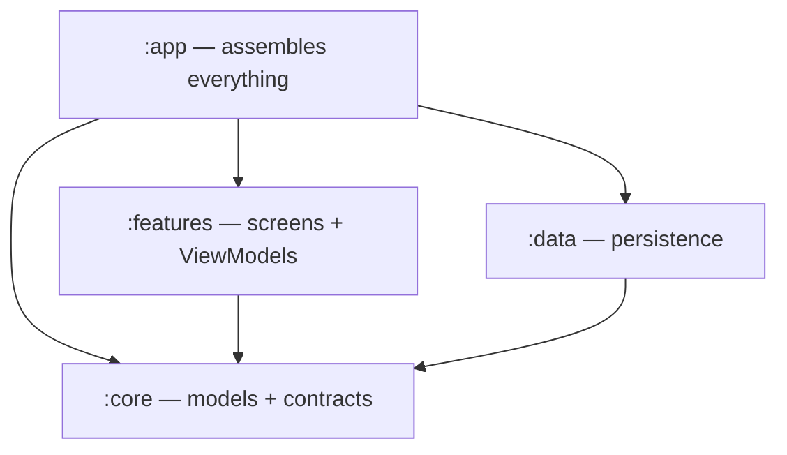

# Gradle And Modules

How ~150 Kotlin files become one installable app, and why they are split into four folders.

## Gradle is the build tool

**Gradle** reads instruction files named `build.gradle.kts`, downloads the libraries the project needs, compiles the code, runs code generators, packages the result, and can run tests. You do not call the Kotlin compiler by hand; you ask Gradle for an outcome and it works out the steps.

You run it through the wrapper script in the project root, so everyone uses the identical Gradle version:

```bash
./gradlew assembleDebug
```

`gradlew.bat` is the Windows equivalent. See [[Learn/Build And Run|Build And Run]] for the useful commands.

## A module is a compilation unit

`settings.gradle.kts` lists the modules:

```kotlin
rootProject.name = "Kairos"
include(":app")
include(":core")
include(":data")
include(":features")
```

Each is a folder with its own `build.gradle.kts`, its own dependencies, and its own compiled output. Why bother splitting?

1. **Enforced boundaries.** `:features` does not depend on `:data`, so a screen *physically cannot* reach into the database directly. The compiler enforces the architecture — no discipline required.
2. **Faster builds.** Change one screen, and only `:features` and `:app` recompile.
3. **Clarity.** Where a file lives tells you what it is allowed to know about.

## The four modules of Kairos

| Module | Type | Contains | Depends on |
|---|---|---|---|
| `:core` | library | Domain models (`Case`, `Patient`), repository **interfaces**, shared Compose components, theme, media helpers | nothing internal |
| `:data` | library | Room database, entities, DAOs, mappers, repository **implementations**, DataStore, Firestore authorization, backup engine, workers | `:core` |
| `:features` | library | One package per user-facing feature: screen + ViewModel | `:core` |
| `:app` | application | `MainActivity`, `KairosApplication`, navigation graph, bottom bar, authorization gate, home-screen widget, Hilt wiring | `:core`, `:data`, `:features` |



Read the arrows carefully. `:features` and `:data` never point at each other. They meet only at `:core`, through interfaces. That single shape is the reason this codebase is easy to change. See [[Learn/Architecture Patterns|Architecture Patterns]].

Only `:app` uses the `com.android.application` plugin — it is the one that produces an installable artifact. The other three use `com.android.library` and produce reusable pieces.

## Reading a build file

```kotlin
plugins {
    alias(libs.plugins.android.library)
    alias(libs.plugins.kotlin.android)
    alias(libs.plugins.ksp)
    alias(libs.plugins.hilt)
}

dependencies {
    implementation(project(":core"))
    implementation(libs.room.runtime)
    ksp(libs.room.compiler)
}
```

- `plugins` — capabilities added to the build: Android library support, Kotlin, code generation, Hilt.
- `dependencies` — libraries this module uses.
- `project(":core")` — a dependency on another module of this same project.

### Dependency configurations

| Keyword | Meaning |
|---|---|
| `implementation` | I use this internally; modules that depend on me do **not** see it. |
| `api` | I use this **and** expose it, so dependants see it too. |
| `ksp` | This is a code generator, not a runtime library. |
| `debugImplementation` / `releaseImplementation` | Only in that build type. |
| `testImplementation` / `androidTestImplementation` | Only when running tests. |

`:core` uses `api` for Compose, Material 3, Coil, and Media3 precisely so `:features` inherits them without repeating the list. `:app` uses `debugImplementation(libs.firebase.appcheck.debug)` and `releaseImplementation(libs.firebase.appcheck.playintegrity)` — the debug build attests with a debug provider, the release build with Play Integrity.

## The version catalog

`gradle/libs.versions.toml` is one file listing every library and its version:

```toml
[versions]
room = "2.7.0"
hilt = "2.54"

[libraries]
room-runtime = { module = "androidx.room:room-runtime", version.ref = "room" }
```

Modules then refer to `libs.room.runtime` instead of typing a version string. Upgrading Room means editing one line, and every module moves together. The dotted name in Kotlin maps to the dashed name in the TOML file.

`platform(libs.compose.bom)` is a **BOM** (bill of materials): a coordinated set of Compose versions known to work together, so individual Compose libraries are listed without versions at all.

## KSP — the code generators

**KSP** (Kotlin Symbol Processing) reads your annotations at build time and writes extra Kotlin files. Two generators run in Kairos:

- **Room compiler** turns `@Dao` interfaces and `@Query` SQL into real implementations, and verifies the SQL against the schema *at build time*. A typo in a table name fails the build rather than crashing at runtime.
- **Hilt compiler** turns `@Inject`, `@Module`, and `@Provides` into the code that constructs objects.

Generated files land under `data/build/generated/ksp/...` — for example `CaseDao_Impl.kt`. They are build output: never edit them, never commit them.

`data/build.gradle.kts` also configures Room to export its schema:

```kotlin
ksp {
    arg("room.schemaLocation", "$projectDir/schemas")
    arg("room.generateKotlin", "true")
}
```

Those exported schema files are what make safe database [[Components/Utilities/Migrations|migrations]] verifiable.

## Build types

`:app` defines a `release` build type that:

- turns on **minification** (`isMinifyEnabled = true`) — unused code is stripped and names shortened, guided by `proguard-rules.pro`;
- signs the APK using credentials from `keystore.properties`, a file kept **out of version control**;
- fails the build via a custom `verifyProductionReleaseConfig` task if any signing property or the key file is missing.

That last part is a deliberate safety net: an unsigned or misconfigured release cannot be produced by accident.

## Java 17

Every module sets `sourceCompatibility`/`targetCompatibility` to 17 and `jvmTarget = "17"`. Kotlin compiles to Java bytecode, and this fixes which bytecode level. If you see "Unsupported class file major version", it is a mismatch between your installed JDK and this setting.

## Related pages

- [[Overview/Gradle Modules|Gradle Modules]]
- [[Overview/Build System|Build System]]
- [[Overview/Dependencies|Dependencies]]
- [[Learn/Build And Run|Build And Run]]
