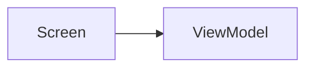

# How To Read This Wiki

This page explains the shape of every other page, so nothing surprises you.

## What a wiki page is

Each page is a plain text file ending in `.md` (Markdown). Markdown is text with a few punctuation rules: `#` makes a heading, `-` makes a bullet, and backticks make `code look like this`. Nothing here is executable — the wiki only *describes* the app.

## The link syntax

Links look like this:

```
[[Components/Repositories/CaseRepository|CaseRepository]]
```

The part before `|` is the file path inside the `docs` folder. The part after `|` is the text you see. Clicking it opens that page. This format is Obsidian-style; if you open the `docs` folder in [Obsidian](https://obsidian.md) the links become clickable and you get a graph view of the whole wiki. In a plain text editor they are still readable — just treat them as "see also".

## Sections you will keep seeing

| Section | What it means |
|---|---|
| **Purpose** / **Role** | One or two sentences: why this thing exists. |
| **Responsibilities** | The jobs this piece of code is allowed to do. |
| **Dependencies** | Other pieces it needs in order to work. |
| **Called By** | Who uses it. Read this to understand impact of a change. |
| **Calls** | What it uses in turn. |
| **Important Methods** | The named actions you can ask this code to perform. |
| **Design Patterns** | The standard, named solutions being applied — see [[Learn/Design Patterns Glossary\|Design Patterns Glossary]]. |
| **Common Pitfalls** | Real traps. Read these before changing anything. |
| **Source references** | The actual code files that back up the page. |

## How to read a "Source reference"

A line like:

```
data/src/main/java/com/taha/kairos/data/repository/CaseRepositoryImpl.kt
```

is a folder path starting from the project root (the folder containing `build.gradle.kts`). Reading it left to right:

- `data` — the Gradle module. See [[Learn/Gradle And Modules|Gradle And Modules]].
- `src/main/java` — fixed boilerplate. Every module has it. Ignore it.
- `com/taha/kairos/data/repository` — the **package**, a namespace that mirrors the folders.
- `CaseRepositoryImpl.kt` — the file. `.kt` means Kotlin source code.

So the useful information in that long path is only: *module `data`, package `repository`, file `CaseRepositoryImpl`*.

## A mermaid diagram

Some pages contain blocks like:

````

````

That is a diagram written as text. Arrows mean "depends on" or "sends data to", depending on the page. Obsidian and GitHub render these as pictures; in a plain editor you read the arrows literally.

## Reading order if you are new

1. This section — [[Learn/Learn Index|Learn Index]] — top to bottom.
2. [[Overview/Project Overview|Project Overview]] for the product.
3. [[Learn/Code Tour One Feature|Code Tour One Feature]] to see all layers at once on one real example.
4. Then dive into whichever [[Features/Features Index|Feature]] you care about.

## Wiki conventions used here

- Behaviour described matches the source code at the time of writing. When code changes, the page's **Source references** tell you which files to re-check.
- Pages link to the concept that *owns* a detail rather than repeating it. If a page seems to stop short, follow the link.
- Beginner explanations live in an **In plain words** block near the top of a page, or in this `Learn` section. Everything else stays terse on purpose — reference material is meant to be scanned, not read like a book.

## Related pages

- [[Learn/Learn Index|Learn Index]]
- [[Learn/Glossary|Glossary]]
- [[Home]]
