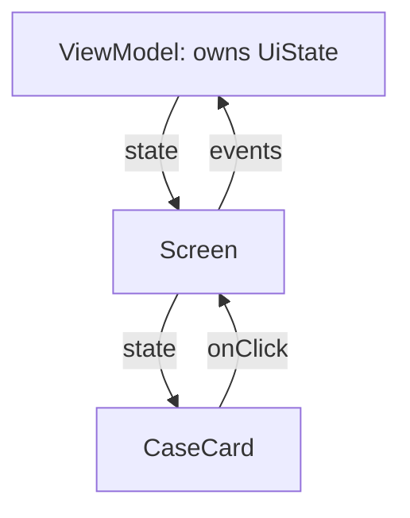

# Jetpack Compose Basics

Every screen in Kairos is written in Jetpack Compose. This page explains the model.

## The old way vs the Compose way

Traditionally you built a screen once, then wrote code to *mutate* it: find the label, set its text, hide the spinner, add a row. Every state change had to be manually applied to widgets already on screen, and bugs came from forgetting one.

Compose is **declarative**. You write a function that says "given this state, the screen looks like this". When the state changes, Compose re-runs your function and updates only what actually differs.

```
old:  state changes → you manually patch the UI
new:  state changes → UI is re-described from scratch → Compose diffs it
```

## A composable is a function that draws

```kotlin
@Composable
fun CaseFeedScreen(
    onNavigateBack: () -> Unit,
    onCaseClick: (caseId: Long) -> Unit,
    viewModel: CaseFeedViewModel = hiltViewModel(),
) {
    val state by viewModel.ui.collectAsStateWithLifecycle()
    ...
}
```

That is the real `CaseFeedScreen`, and it demonstrates the four conventions Kairos follows everywhere:

1. `@Composable` marks it as UI. Composables may only be called from other composables.
2. Composable names are **capitalised** (`CaseCard`, not `caseCard`) and return nothing — they emit UI as a side effect.
3. Navigation arrives as **callbacks** (`onNavigateBack`, `onCaseClick`), never as a navigation controller. The screen says *what happened*; someone above it decides *where to go*. This keeps screens previewable and testable.
4. The ViewModel is obtained via `hiltViewModel()` with a default value, so tests and previews can pass a different one.

## State and recomposition

**Recomposition** is Compose re-running a composable because something it read changed. To make that work, state must be held in something Compose can observe.

```kotlin
val state by viewModel.ui.collectAsStateWithLifecycle()
```

This subscribes to the ViewModel's `StateFlow` (see [[Learn/Coroutines And Flow|Coroutines And Flow]]) and turns it into a Compose-observable value. When the ViewModel publishes new state, this screen redraws. `...WithLifecycle` means the subscription pauses when the screen is not visible — no wasted work in the background.

The `by` keyword lets you write `state.cases` instead of `state.value.cases`.

For small, screen-local state you use `remember`:

```kotlin
var expanded by remember { mutableStateOf(false) }              // survives recomposition
var handled by rememberSaveable { mutableStateOf(false) }       // also survives rotation
```

- `mutableStateOf` — a value Compose watches.
- `remember` — keep it across recompositions (otherwise it would reset every redraw).
- `rememberSaveable` — additionally survive configuration changes like rotation.

The rule Kairos follows: **business state lives in the ViewModel; only throwaway UI state (a dropdown being open, a dialog being shown) uses `remember`.** See [[Architecture/State Management|State Management]].

## State hoisting

Notice that `CaseFeedScreen` holds no case data of its own — it receives state and emits events upward. This is **state hoisting**: push state up to a single owner, pass data down, pass events up. The result is one source of truth and no two components disagreeing about what is on screen.



## Modifiers

```kotlin
Modifier
    .fillMaxSize()
    .padding(padding)
    .padding(horizontal = 16.dp)
```

A `Modifier` is a chain of decorations applied to a component: size, padding, background, click handling. **Order matters** — padding then background paints differently from background then padding. By convention a composable takes `modifier: Modifier = Modifier` as its first optional parameter so callers can adjust it.

`dp` is *density-independent pixels*, a unit that stays the same physical size across screens of different pixel densities. Text uses `sp`, which additionally respects the user's font-size setting.

## The layout vocabulary

| Composable | What it does |
|---|---|
| `Column` | stacks children vertically |
| `Row` | stacks children horizontally |
| `Box` | overlays children |
| `LazyColumn` | a scrolling list that only composes visible rows |
| `Scaffold` | standard screen frame: top bar, bottom bar, content slot |
| `Text`, `Icon`, `Button`, `IconButton`, `TextField` | the primitives |

`LazyColumn` matters for performance. A shift with 500 cases composes only the dozen rows on screen:

```kotlin
LazyColumn {
    items(state.cases, key = { it.id }) { case ->
        CaseCard(case = case, onClick = { onCaseClick(case.id) })
    }
}
```

The `key = { it.id }` is important: it tells Compose which row is which across updates, so inserting one case does not redraw and re-animate the whole list.

## Slots

`Scaffold(topBar = { ... }, bottomBar = { ... }) { padding -> ... }` takes composable lambdas as arguments. This is the **slot pattern**: a component provides structure, the caller provides content. The trailing lambda receives `padding` — the space the bars occupy — which the content must apply, otherwise it will be drawn underneath them.

## Theme

`KairosTheme` wraps the whole app and supplies colours, typography, and shapes through Material 3. Inside it, components read `MaterialTheme.colorScheme.primary` rather than hard-coded colours, which is how light/dark mode works with no per-screen code. `MainActivity` chooses light or dark from the saved setting, falling back to the system preference. See [[Components/UI/Kairos Theme|Kairos Theme]].

## Side effects

Composables must be safe to re-run at any time, so anything that should happen *once* — not on every redraw — goes in a side-effect block:

```kotlin
LaunchedEffect(Unit) {
    delay(1_500L)
    minimumLaunchDisplayFinished = true
}
```

`LaunchedEffect(key)` runs a coroutine when first composed, and restarts it only if `key` changes. `MainActivity` uses it for the minimum splash duration and for consuming a widget deep link exactly once.

## Previews

`@Preview` renders a composable in Android Studio without running the app. This only works if the composable does not fetch its own data — another reason Kairos passes state and callbacks in.

## Related pages

- [[Layers/UI Layer|UI Layer]]
- [[Architecture/State Management|State Management]]
- [[Components/UI/Reusable UI Components|Reusable UI Components]]
- [[Learn/Coroutines And Flow|Coroutines And Flow]]
