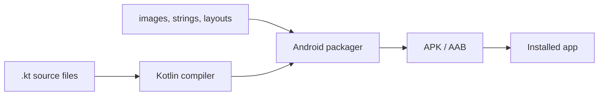

# What Is An App

From typed text to an icon on a phone. This page has no Kairos specifics — it is the mental model everything else sits on.

## Source code is just text

The whole of Kairos is about 150 text files ending in `.kt`. A human wrote them. They contain instructions in a language called **Kotlin**. On their own they do nothing — like a prescription written on paper.

## The build turns text into an app

A **build** is an automated process that reads all those text files, checks them for mistakes, translates them into a form the phone's processor understands, bundles them together with images, fonts, and settings, and produces a single installable file:

- **APK** — Android Package. One file, installable directly on a phone.
- **AAB** — Android App Bundle. What you upload to Google Play; Play generates per-device APKs from it.

In Kairos the build is run by **Gradle** — see [[Learn/Gradle And Modules|Gradle And Modules]].

## Compile time vs runtime

Two different worlds, and the wiki assumes you can tell them apart.

- **Compile time** — when the build runs, on a laptop. Typos, wrong types, and missing pieces are caught here. Nothing has run yet.
- **Runtime** — when a person taps the icon and the code actually executes on a phone. Crashes, empty screens, and slow saves happen here.

A "compile error" means the app could not even be built. A "crash" means it built fine but exploded while running. Very different problems.

## What "running" means

When the app launches, the phone's Android system creates a **process** — a private sandbox of memory dedicated to Kairos. Inside it, code runs, screens are drawn, and data is loaded. When the app is closed or the system needs memory, the process may be killed and everything held only in memory disappears. This is precisely why data must be **written to a database or a file** to survive — see [[Learn/Databases And Room|Databases And Room]].

## Debug vs release

Two builds of the same code, with different settings:

- **Debug** — built for developing. Larger, slower, includes diagnostics, signed with a throwaway key. Kairos additionally uses a debug-only Firebase App Check setup here.
- **Release** — built for real users. Optimised, shrunken, signed with the project's private signing key, and refuses to build if that key is missing. See [[Overview/Build System|Build System]].

## Offline-first

Most apps you use are thin windows onto a server: no internet, no data. Kairos is the opposite — **offline-first**. The phone holds the real, authoritative copy of every patient and case. The network is used for exactly one thing: checking whether this device is still allowed to run the app. That single design decision explains most of the architecture in this wiki.

## Related pages

- [[Learn/Programming Fundamentals|Programming Fundamentals]]
- [[Learn/Android App Basics|Android App Basics]]
- [[Learn/Build And Run|Build And Run]]
- [[Overview/Project Overview|Project Overview]]
