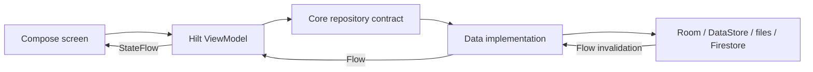

# Architecture

> **In plain words** — the app is organised as a chain of layers, each one only allowed to talk to the next. A **screen** shows things and reports taps. A **ViewModel** holds what the screen should currently display and decides what to do about a tap. A **repository** owns one kind of data and hides where it is stored. The **store** is the actual database, file, or network call. Data flows up the chain, user events flow down it, and no layer skips a step. Why it is done this way: [[Learn/Architecture Patterns|Architecture Patterns]]. A worked example through every layer: [[Learn/Code Tour One Feature|Code Tour One Feature]].

Kairos uses a multi-module, repository-oriented architecture. Compose screens delegate state and actions to Hilt ViewModels; ViewModels depend on contracts in `:core`; Hilt supplies implementations from `:data`; implementations coordinate Room, DataStore, Firestore, WorkManager, and files.

## Boundaries

- `:features` imports `:core`, never `:data`.
- `:data` implements contracts from `:core`.
- `:app` is the composition root: it depends on all modules, hosts navigation, and owns process-level concerns.
- There is no separate use-case module. ViewModels orchestrate repository contracts directly.
- Cross-resource writes and backup/restore share `DataSafetyCoordinator` to prevent unsafe overlap.

## Runtime Style

- Reads are primarily reactive `Flow` streams converted to lifecycle-aware `StateFlow`.
- Writes run in `viewModelScope`, repository transactions, and a process-wide data mutex where consistency matters.
- Navigation passes IDs, then destination ViewModels reload the current domain object.
- Authorization is a fail-closed outer gate around the entire navigation host.

Continue with [[Architecture/Data Flow|Data Flow]], [[Architecture/State Management|State Management]], [[Architecture/Dependency Injection|Dependency Injection]], and [[Diagrams/Project Architecture|Project Architecture]]. Layer details are in [[Layers/Layers Index|Layers]].

## Source references

- `settings.gradle.kts`
- `app/src/main/java/com/taha/kairos/MainActivity.kt`
- `features/src/main/java/com/taha/kairos/features/patient/PatientCaseViewModel.kt`
- `core/src/main/java/com/taha/kairos/core/repository/CaseRepository.kt`
- `data/src/main/java/com/taha/kairos/data/repository/CaseRepositoryImpl.kt`
- `data/src/main/java/com/taha/kairos/data/backup/DataSafetyCoordinatorImpl.kt`
