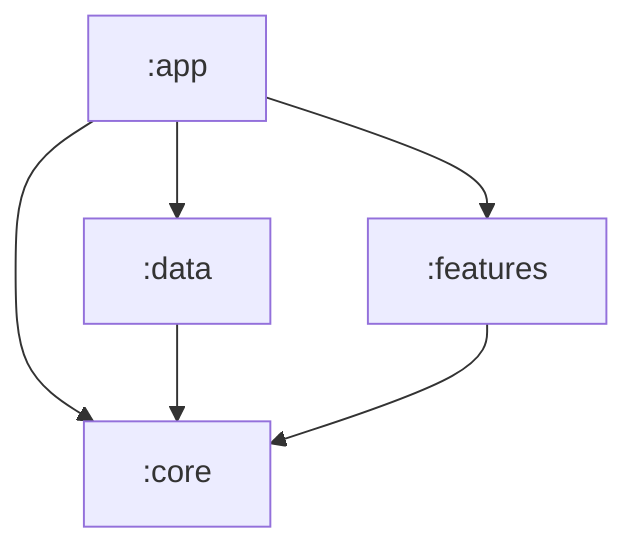

# Gradle Modules

> **In plain words** — the source code is split into four separate folders that are compiled separately, called *modules*. `:core` holds the shared vocabulary (what a Case is, what can be asked of the data). `:data` holds the actual storage code. `:features` holds the screens. `:app` glues everything together and is the only one that produces an installable app. The important trick: `:features` is not allowed to depend on `:data`, so a screen physically cannot reach into the database — the compiler enforces the architecture instead of relying on discipline. See [[Learn/Gradle And Modules|Gradle And Modules]].

| Module | Type | Owns | Project dependencies |
| --- | --- | --- | --- |
| `:app` | Android application | Entry points, authorization orchestration/UI, navigation, bottom bar, widget, build-variant App Check | `:core`, `:data`, `:features` |
| `:core` | Android library | Domain models, repository contracts, authorization policy, shared UI/theme/media helpers | None |
| `:data` | Android library | Room, DataStore, Firestore authorization, implementations, backup, workers, DI bindings | `:core` |
| `:features` | Android library | Feature screens and ViewModels | `:core` |

## Boundary Rules

- Feature code consumes `core.repository` interfaces and must not import Room or data implementations.
- Data code maps storage entities to `core.model` domain objects.
- App code assembles feature screens, data bindings, and process-level Android components.
- Shared Compose dependencies are exported by `:core` with `api`, so its public components and model-facing UI types remain usable by consumers.

See [[Diagrams/Dependency Graph|Dependency Graph]], [[Overview/Architecture|Architecture]], and [[Architecture/Dependency Injection|Dependency Injection]].

## Source references

- `settings.gradle.kts`
- `app/build.gradle.kts`
- `core/build.gradle.kts`
- `data/build.gradle.kts`
- `features/build.gradle.kts`
